\newpage

# Why I Wrote This

I wrote this guide because of a question I kept getting asked. My courses have been well received—colleagues praised not just the content but the way I delivered it—and, again and again, that praise turned into one question: *"Could you teach me to build classes the way you do?"* The people asking had something worth sharing but didn't know how to turn that knowledge into actual content. This guide is my answer.

To answer it honestly, I have to back up—because I never wanted to be an instructor. I thought my place in academia was in research—exploring the world through my own understanding. But I always had a knack for taking complex ideas and breaking them into small, understandable pieces, and for seeing the whole picture before I'd mastered every detail underneath it. That let me present new material in a way audiences responded to warmly. It just never occurred to me that I could turn that into teaching.

What I did know was that I loved helping beginners. I've always kept a beginner's mindset, and bringing someone into my world and helping them find their footing has always brought me real joy. That instinct—meeting people where they are and walking them forward—is the whole of teaching. I just didn't have a name for it yet.

So when the chance to teach finally came—late, and almost by accident, as a side job—the instinct was already there. To my surprise, I was good at it. And without fully realizing it at the time, I'd walked into something larger: at Georgetown, where I taught as an adjunct for the past eight years, instructional designers were training me to be an effective educator. I got hands-on, research-grounded instruction in how to build a course—how to turn my own expertise into curriculum that actually works.

This guide is what came out of that. I've taken everything I learned over those eight years, mixed it with my own experience and methodology, and tried to hand you something you can use to deliver curriculum that's meaningful and well received—the kind that leaves students feeling fulfilled, like they gained a real experience and walked away with a new toolset for their job. Here's my guarantee: follow this guide and hold to its principles, and you'll build a course solid enough that someone else could come behind you and teach it.

The knack got me in the room; the training is what turned it into something I could repeat—and hand to someone else. Because in the end, building great curriculum isn't about talent. It's about having access to the resources and knowledge that let you fully express what you know—in a way that's meaningful to your students.

---

**Who this is for:** Any subject-matter expert who needs to build a course or training — anyone who holds knowledge they want to share. You know your subject; you're not a professional course designer.

\begin{mdframed}[style=cmcta]
\textbf{The promise.}\, Follow this guide end to end and you'll have \emph{a course solid enough that someone else could pick up and teach it.}
\end{mdframed}

---

# How to Use This Guide

**Work through it in order — each step feeds the next.** This isn't a book to browse; it's a build. Go top to bottom for your first module, and by the end you'll have produced:

- a **Decisions document** (§1) — the choices everything else inherits,
- measurable **learning objectives** (§2),
- a **seven-practices audit** (§3) of your design,
- a **Master Design Document** (§4) — your course's blueprint, and
- one complete **three-package module** (§5–§6) — built and ready to teach.

*(Sections 7 and 8 — depth and accessibility — are principles you apply across all of it; Section 9 sends you back to improve after you've taught.)*

Two things do the heavy lifting for you:

- **Blank templates** for every artifact, gathered in **Section 10** — fill them in as you go.
- **A filled-in example of the whole thing** — the **Intro-to-ML Worked Example** that ships with the guide. When a step feels abstract, open it and copy the pattern.

**The file paths in this guide are links.** Every path you see — a template, a worked example — is clickable and opens the file beside this one: templates open as **Word documents** (they're forms you fill in), examples and companions as **PDFs**. Two things to know. **Download and open this guide in a desktop PDF reader** (Preview, Acrobat) for the links to work — a PDF *viewed inside a browser tab* won't follow them, which is a browser limitation, not a broken link. And every path is **printed in full as well as linked**, so if a link doesn't fire you can always just go find the file.

> **Building one session?** Then your course *is* one module, and you can take the short road: §1 (decisions), §2 (two or three objectives), §3 (the audit), §3.5 Steps 1–2 plus the fit-check, §4 (one table), §5, and §6a. Run one Review-Council pass; skip the deep dives and the Design Council unless you get stuck. Everything else in this guide is still true — it's just more than you need today.

**Your fastest path.** Write your one-page Decisions doc, then walk Sections 2–6 once for a single module. **Build one module end to end before scaling to the rest** — it templates everything that follows.

**Using AI alongside this guide.** AI does **seven different jobs** here, and only one of them is drafting. Throughout you'll meet callouts marked **AI can help here**, each naming the job it's doing — *tutor, widen, check, simulate, translate, carry,* and finally *produce*. They're collected on one page in the **Directing AI** card.

Two things to notice now, because they explain the shape of everything that follows. **PRODUCE appears only in §6** — AI drafts nothing before then, which is what *decisions before production* actually means in practice. And **TUTOR is available at every step**: you are a subject-matter expert, not an instructional designer, so when a term in this guide is unfamiliar, ask —

> *"I'm a subject-matter expert, not an instructional designer. When I hit a term I don't know — gradual release, altitude, scaffolding, UDL — explain it using my own subject as the example, and tell me which section it matters in."*

One job is deliberately withheld: **estimating how long things take.** That is the question AI is worst at and most confident about. Use the Contact-Hour companion and your own measured pace.

**Words this guide uses.** A few terms, defined where you first meet them rather than in a glossary you'd have to go find:

- **LLM** — a large language model: ChatGPT, Claude, Gemini and the like. When this guide says "the AI," that's what it means.
- **System prompt** — the standing instruction you give an AI tool at the start of a project, so you don't retype your context every time.
- **Scaffolding** — the support you build into practice material, and then remove as students get stronger. §5's gradual-release ramp is scaffolding made concrete.
- **Altitude** — how high or low an objective aims on Bloom's ladder: *list* is low altitude, *design* is high. Neither is better; they're for different goals.
- **Stub** — an empty placeholder file, created so the structure is visible before the content exists.
- **Teach-back** — a student explaining the thing back to you, used as evidence they can actually do it.
- **Advance organizer** — something you give learners *before* the content that gives them somewhere to put it (a map, an analogy, a question).

---

# 0. The Big Picture

Building a course looks like a lot of writing. It isn't — it's a sequence of **decisions**, and the writing falls out of them. The whole method is six steps, and it fits on one line:

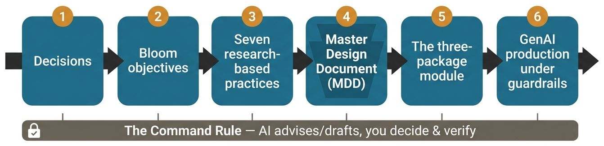{width=100%}

Here's what each step is and why it's there:

- **Decisions** — the one page of choices only you can make: who it's for, what they'll be able to do, how deep you go, in what tone. **Your values are the first line of it**, so every later choice reflects them.
- **Bloom objectives** — the specific, *observable* things a student will be able to do by the end. They're the target everything else aims at.
- **Seven research-based practices** — a quick design audit, drawn from how people actually learn, that surfaces where a course will feel weak *before* you build it. It runs **against your objectives and decisions**, which is why it comes after them, not before.
- **Master Design Document (MDD)** — the blueprint mapping every module to its objectives, activities, and assessments: your single source of truth.
- **The three-package module** — instructor materials, student materials, and a teaching guide, built so someone else could pick it up and teach it.
- **GenAI production under guardrails** — drafting the actual materials with AI doing the heavy lifting while you stay in control of quality.

**Two principles hold all six together.**

**First — decisions before production.** Take the time to make the key decisions about your course — who it's for, what they'll be able to do, how deep to go, in what tone — *before* you create any artifacts (assessments, slides, notebooks). Everything downstream runs on those decisions, which is what lets a tool (GenAI, or a teammate) produce most of the material while you keep control of quality. Skip them and you'll write fast and wander; make them first, write them down once, and ten modules come out sounding like one course.

**Second — the Command Rule.** As you work through these steps, you'll put **AI** to work — drafting materials, pressure-testing them, reviewing a draft. The same rule holds every time: **the AI proposes; you decide and verify.** The AI widens your perspective and does the heavy lifting of drafting, but it never makes the final call — **you do.** (The same holds for any human advisor you bring in later.) You've heard "keep a human in the loop"; **the Command Rule is what that means in practice** — the AI drafts, you decide, the same way every time. Wherever you see "it advises, you decide" in this guide, that's the Command Rule.

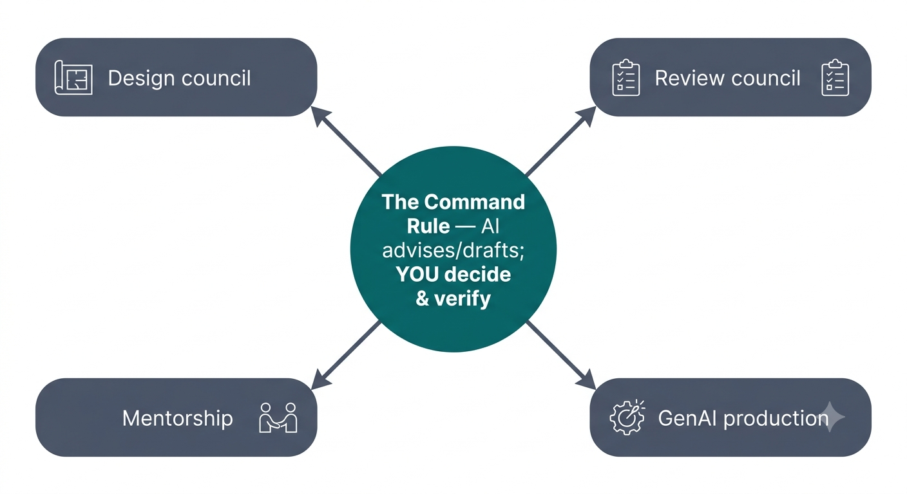{width=68%}

Both come down to the same first move — decide before you produce. So that's where we start: a single page of decisions.

---

# 1. Start With Decisions

**The first decision is what to teach** — and this guide takes that one as already made. It assumes you're a **domain expert** with a solid working grasp of your subject. That matters for one concrete reason: you'll be directing AI to draft your material, and **AI fabricates** — confidently, plausibly, and often. You have to know the topic well enough to catch it when it does. So if you're tempted to build a course on something you *don't* know deeply, treat this AI-driven approach with caution — either pick a subject you can vouch for, or commit the time to investigate the new one thoroughly first. (How to *choose* a topic is its own craft; this guide doesn't cover it, and assumes yours is set.)

With your topic set, the first real work isn't writing — it's deciding. Before you make any material, write a **one-page Decisions document**. It captures the choices that a tool (or a person) is bad at making and that everything else inherits. Keep it to one page — if it's growing past that, you're mixing in *method* or *build plans* (those go elsewhere). Here's the test for what earns a place: **only choices unique to *this* course that *constrain* production belong in the Decisions doc.**

Decide and write down:

- **Audience** — who they are, what they already know, what they're *not* expected to know.
- **Objective** — what they should be able to *do* at the end (production, not theory, for most workplace training).
- **Depth** — how far down you go. The rule: go only as deep as the goal needs, and stop where going deeper would satisfy you more than it helps them (§7 has the full test).
- **Scope** — what's in, what's explicitly out.
- **Tone & how you give help** — how warm/formal you are, and your approach to **hints**: the guidance you leave for students *when you're not in the room* (a reminder of the *purpose* of a step, never the answer handed over). This is how your voice reaches a student working alone. (More on hints in the scaffolding part of Section 5.)
- **Frameworks / tools** — what they'll use.
- **Values** — two or three, one line each, your organization's own. You'll map each to a concrete course feature in the MDD (§4), so keep them specific enough to build from.
- **Container** — session length × number of sessions = your **contact hours**. Note any shared stations or equipment, since those set the real pace.
- **Scaffolding form** — what your three rungs look like in your medium: **you demonstrate it, then you do one together, then they do one alone.** Name what each rung actually is for your course. *(§5 builds this out as the gradual-release ramp.)*
- **Who teaches it** — only you, or someone else? If it's only ever you, your teaching guide can stay light: an agenda plus a few talking points. If anyone else might pick it up, you'll need a fuller script. *(§5 sets out the two tiers.)*
- **Gates** — anything a student must pass before they're allowed to do the next thing. For safety-critical skills, decide this first. *(A gate is completion, not a grade.)*

**These are the fields most courses need — not a form to complete.** Add any decision that will constrain what you build, and drop any that doesn't apply: the ML example below adds *datasets*, *algorithms* and *frameworks* because those genuinely steer every module; the coffee course needs none of them. **The test: if you'd want it carried through every module, it belongs on this page.**

*Blank form:* [`templates/Decisions_TEMPLATE.docx`](templates/Decisions_TEMPLATE.docx). *Example:* see [`2_Worked_Examples/IntroML/01_Decisions.pdf`](../2_Worked_Examples/IntroML/01_Decisions.pdf) — the entire Decisions doc for an 8-week ML course on one page.

> **AI can help here — CARRY.** Once this page is filled, paste it in at the start of every AI session so you never restate the audience, depth or tone.
>
> *"This is my Decisions doc. Treat it as fixed context for everything I ask from now on."*
>
> **Verify:** when a later draft contradicts this page, the context slipped — re-paste it.

**Why first — and how you'll use it.** This one page becomes the standing context for everything downstream. You'll lean on it when you write objectives (§2) and build the MDD (§4); most of all, when you direct GenAI to produce materials (§6), you hand the Decisions doc to the AI so every draft already knows the audience, depth, and tone — you never re-explain them, and you keep a fixed reference to check the AI's output against. That's what makes ten separately-built modules come out sounding like one course.

With your decisions on one page, the guesswork is gone — next, turn them into objectives: the specific, observable things a student will be able to *do*.

---

# 2. Write Learning Objectives

**Why bother.** An objective is a promise about what the *student* will be able to do by the end — stated so plainly you could turn it straight into a test question. Written well, objectives stop students guessing what matters (guess wrong and they look lazy when they were just lost), they hand you your assessments for free (just ask students to do what the objective says), and they're the goalposts a substitute instructor — or the student — can aim at. As Robert Mager put it: *if you don't know where you're going, how will you know which road to take, or when you've arrived?*

**The thread to keep in view.** Objectives are the hinge of the whole method. Your **course objectives (COs)** say where the course is going; each one spawns **module objectives** that ladder up to it; and each module objective then defines *two* things downstream — the **assessment** that proves a student met it, and the **module** built to get them there. Get the objectives right and §3.5 (decompose), §4 (the MDD), and your assessments all have a target to aim at. (This alignment of *objective → assessment → activity* is the backbone of backward design, §3.5.)

**Anatomy of a good objective.** A strong one has up to three parts: a **verb you can observe** (the performance), an optional **condition** (what the student is given), and an optional **criterion** (how good is good enough).

- *Coffee:* "**Given** the pour-over kit, **brew** a cup to a 1:16 ratio in under four minutes."
- *ML:* "**Given** a trained model, **judge** its fit using MSE, RMSE, and R², and **explain** the result to a non-technical stakeholder."

In each, you could hand the student the condition and watch them perform — which is exactly what makes the objective testable.

**Pick the verb with Bloom's Taxonomy.** The verb declares the level of thinking — match it to what students actually need to do.

**Why this taxonomy, and not just "pick a strong verb."** Thinking comes in levels, and they stack: you can't *evaluate* a model before you can *run* one. Bloom's contribution was to sort the verbs by how much thinking each demands and put them in that order — so the verb you choose isn't decoration, it's a claim about how far up the stack you're asking students to climb. That matters for two practical reasons. **It makes the work visible**: "remember the formula" and "critique someone else's model" are wildly different asks that a vague verb like "learn" hides completely. And **it keeps you honest about difficulty** — if every objective in your course sits on the bottom rung, you've written a course about facts, whichever way it's advertised. You don't need the theory to use it. You need to know that the ladder exists, that the rung you name is the rung you'll have to teach and assess, and that choosing it is a design decision rather than a bid for ambition — which is what the next two paragraphs are about.

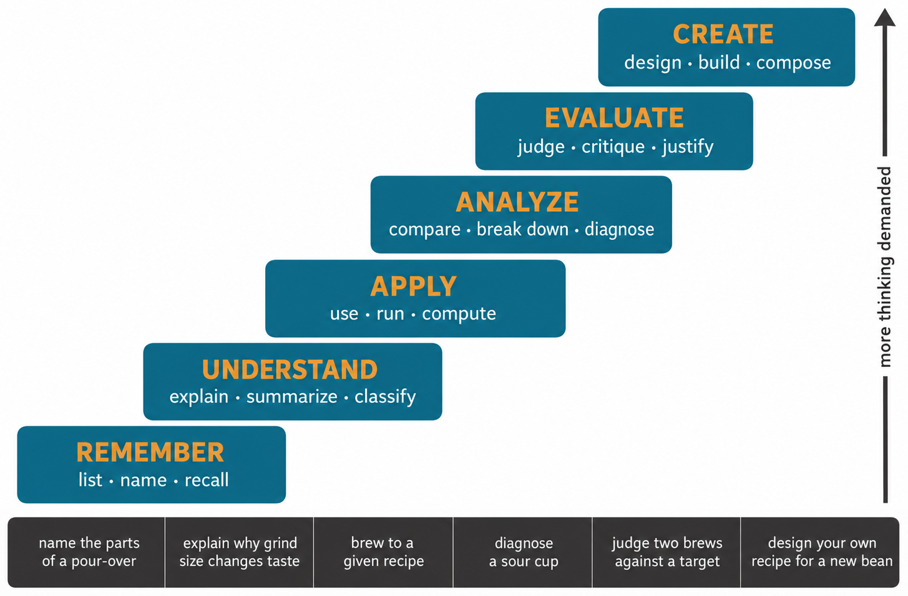{width=100%}

| Level | What it asks of the student | Sample verbs |
|---|---|---|
| Remember | recall facts as given | define, list, name, recall |
| Understand | explain an idea in your own words | summarize, explain, interpret |
| Apply | use it in a new situation | apply, build, solve, implement |
| Analyze | break it apart, see how the pieces relate | analyze, distinguish, compare |
| Evaluate | judge it against criteria | assess, justify, critique |
| Create | combine pieces into something new | design, develop, compose, propose |

*(Full verb lists per level and the words-to-avoid list are in Appendix A.)*

**Aim for the highest level the content honestly supports — and here's why.** Left alone, courses drift to the bottom of that table: studies of intro courses find the large majority of objectives and test items sit at Remember/Understand — "a mile wide and an inch deep," memorization that fades. A skills course earns its keep up in **Apply / Analyze / Create**, where students do something that transfers to the job. So push up the table as far as the real goal allows — *but no further.* If your audience genuinely only needs to *explain* a concept (say, how grind size affects taste), Understand is the honest call; don't inflate the verb past what students actually need.

**Avoid the unobservable verbs** — *understand, know, learn, appreciate, be familiar with, grasp.* The reason is simple: **you can't see them.** No assessment observes "understanding"; you can only watch a student *do* something — describe, predict, brew, evaluate. If a verb names something happening invisibly inside a head, swap it for a Bloom verb that names the visible performance.

**A subtlety worth flagging:** "Understand" is a Bloom *level*, not a usable verb. The level is perfectly valid — plenty of good objectives live there — but you write it with an observable verb like *explain*, *interpret*, or *summarize*, never the word "understand" itself.

**The three traps — and why each one fails.** Each row is the same learning target written two ways — a weak objective that falls into the trap, then a strong one that fixes it (shown in coffee, so the trap is the only technical part):

| Trap | Weak objective | Strong objective | Why the weak one fails |
|---|---|---|---|
| Instructor-focused | "Demonstrate how to pour over grounds." | "Given a pour-over kit, pour in a steady spiral to a 1:16 ratio." | Describes what *you* do, not what the *student* can do — your activity, not their learning. |
| Activity, not learning | "Watch the grinding tutorial." | "Given a burr grinder, grind beans to a medium pour-over consistency." | "Watch the tutorial" is one *activity*; the learning is the *grinding* — naming an activity early boxes in how you teach *and* assess. |
| Not measurable | "Understand how grind affects taste." | "Predict how a finer grind changes the taste, then test it by brewing both." | "Understand" can't be observed or graded; "predict, then test" is something you can watch and check. |

**Two levels, laddered.** Write **course objectives (COs)** (the few big things true at the *end of the course*) and **module objectives** (specific things true at the end of each module), each module objective tagged to the CO it serves (→CO1…). The CO is the destination; the module objectives are the steps. The same ladder, in a technical course and a non-technical one:

> **ML — Course Objective:** *Implement end-to-end ML pipelines, from data loading to evaluation.*\
> **ML — Week 1 Module Objective:** *Execute a complete pipeline: load → preprocess → train → evaluate → interpret.* (→ that CO)
>
> **Coffee — Course Objective:** *Brew a pour-over to a repeatable recipe (ratio, grind, time).*\
> **Coffee — Module 1 Objective:** *Execute a guided pour-over from bloom to finish, on time.* (→ that CO)

In both, the module objective is narrower and observable, and it already names its own assessment — hand the student the setup and ask them to do exactly that.

**Record them in your Objectives doc.** Capture your course objectives — and, once you decompose (§3.5), the module objectives that ladder to them — in the Objectives template. This is **your Objectives doc**: a living artifact you reuse at every step, the same way you reuse the Decisions doc. The seven-practices audit examines it (§3), you decompose it (§3.5), and it feeds the MDD (§4).

> **AI can help here — CHECK.** Once your objectives exist, test them against the four traps — *instructor-focused, activity-not-learning, not measurable, inflated verb.*
>
> *"Here are my objectives. For each, say which it falls into — instructor-focused, activity-not-learning, not measurable, inflated verb — or 'none'. Do not rewrite them."*
>
> **Verify:** **"Do not rewrite them" is the guardrail.** It diagnoses; you fix. Without it, the AI writes your objectives and the decision has left the room.

> **AI can help here — WIDEN.** Then ask what you left out.
>
> *"My audience is [X], my goal is [Y], here are my objectives. What do courses like this usually include that I haven't written? Don't rewrite mine."*
>
> **Verify:** input, not instruction — you do **not** have to add any of them. The job is to make sure you are excluding things *on purpose, not by accident.*

> **AI can help here — SIMULATE.** And the one that catches real problems:
>
> *"Here is one objective. Write three different things a student might hand in as evidence they met it."*
>
> **Verify:** if what comes back isn't what you had in mind, **the objective is ambiguous** — and you found out before anyone was assessed on it.

*Blank form:* [`templates/Objectives_TEMPLATE.docx`](templates/Objectives_TEMPLATE.docx).\
*Filled examples:* [`2_Worked_Examples/IntroML/02_Objectives.pdf`](../2_Worked_Examples/IntroML/02_Objectives.pdf), [`2_Worked_Examples/Coffee/02_Objectives.pdf`](../2_Worked_Examples/Coffee/02_Objectives.pdf).

You know *what* students will be able to do. Next, pressure-test *how* they'll get there — against seven practices drawn from how people actually learn.

---

# 3. Pressure-Test With the Seven Practices

Your objectives (§2) and the modules you'll build from them make a course **correct** — the right content, in the right order. They do *not* make it **effective** — a course a human actually learns from. Those are different things: a perfectly accurate, perfectly sequenced course can still land cold, read as a pile of facts, give nobody a reason to care, and be forgotten by Friday. **The seven practices are the check that catches that** — seven design checks drawn from the research on how people actually learn (adapted from Georgetown's framework, which builds on *How Learning Works*, Ambrose et al.). A gap in any one is a specific way the course goes flat: no hook, no map, no reason to care, no model of "good," no practice, no safe climate, nothing that lasts past the door.

And they're **generative, not a grade.** You don't pass or fail — you *answer* each practice, and each answer names a **feature** your course needs. **A feature is not an objective.** An objective is the *goal* — what a student can do ("brew a repeatable pour-over"). A feature is a concrete, buildable *piece* of the course that helps them get there — an activity, a material, or a bit of content (a hook, a concept map, a practice, a benchmark, a cheat sheet). Your objectives set the destination; the audit surfaces the features that carry students to it — the parts a list of goals never names, because a goal doesn't tell you how to make it land.

**What you're auditing: objectives + decisions.** At this point your course *is* two things — your **objectives** (what you'll teach) and your **Decisions doc** (who it's for, the tone, the values). You run the seven questions against *that pair,* not any single objective. Most key off the objectives' content (*what would motivate someone to learn this? how do these concepts organize?*); two key off your decisions — **Climate** off your tone and values, **Self-Directed** off what they'll need once you're gone.

*Blank form:*
[`templates/Seven_Practices_Audit_TEMPLATE.docx`](templates/Seven_Practices_Audit_TEMPLATE.docx)

*Filled example:*
[`2_Worked_Examples/Coffee/03_Seven_Practices_Audit.pdf`](../2_Worked_Examples/Coffee/03_Seven_Practices_Audit.pdf) — the whole audit answered for a real course.

> **AI can help here — WIDEN.** Stuck on a practice? Ask for candidates rather than staring at it.
>
> *"I'm answering '[anchor question]' for a course on [X]. Give me five concrete features other courses use. I'll pick or reject."*
>
> **Verify:** input, not instruction. A feature you reject is still a decision made on purpose.

**What you do with them — a checklist, not the build.** You're not making anything yet; you're taking inventory of what the course will need. For each practice, answer its anchor question with a *concrete feature*, not a note — "Activate Prior Learning" isn't "remind them of the basics," it's the specific opening hook you'll build. Can't answer one? **That gap is a design task**: something you now know you have to make, and will build later (§6). Run the audit at the **course level** now — you don't have modules yet; those come next (§3.5) — and each module you build later applies the relevant practices again at its own scale (its own hook, its own practice). One row per practice; the features you list flow into the MDD's *Activities* and *Materials* columns (§4), get sorted into modules there, and get built in §6.

| Practice — what it's for | Anchor question | The answer becomes… |
|---|---|---|
| **Activate Prior Learning** — hook new ideas onto what they already know | What do they already know that this connects to — and what analogy clears up where they'll go wrong? | an opening hook + a two-analogy pair (see *Analogy Craft*, below) |
| **Organize Knowledge** — show the structure, not a pile of facts | How do the key concepts relate and build on each other? | a concept map or a structure they can navigate |
| **Motivate** — give them a reason to care | What would make *them* want to learn this? | a real story, stake, or example they care about |
| **Develop Mastery** — show the target and build toward it | What does good performance look like, and what are the steps to it? | a worked example at the level to aim for |
| **Practice & Feedback** — let them try before it counts | How do they practice, with feedback, *before* being assessed? | a low-stakes practice activity with guidance |
| **Student Development & Climate** — grow the practitioner, for everyone | What traits does a strong practitioner have — and does the course build them, inclusively? | norms, group work, inclusive examples |
| **Self-Directed Learners** — set them up to keep going without you | What lets them keep learning after the course ends? | cheat sheets, resources, optional deep dives |

**What the answers look like** — a few, from the home-coffee course's audit:

- *Activate Prior Learning* → **a first-day exercise:** open the course by having them recall a disappointing cup, then explain why it happened.
- *Motivate* → **an opening hook:** "great coffee at home for pennies a cup," with a real tasting in session one.
- *Practice & Feedback* → **a paired activity + a log:** a brew-along with on-the-spot tasting feedback, then a week-long brew log.
- *Organize Knowledge* → **a concept map:** the whole course on one diagram — grind, water, ratio, and time each a labeled lever on "extraction" (finer grind → faster extraction → bitter if you overshoot), shown session one.

And the audit earns its keep: the coffee author had **no good answer for *Develop Mastery*** until the audit forced one — adding an **instructor reference brew** as the benchmark students taste and aim at. That gap *was* the next design task. (For a full technical version, see how these are answered for Intro-ML in its sample MDD, `03_Sample_MDD_Week1.md`.)

**Put an LLM to work — after your own pass, not before.** Do the audit yourself first; your answers carry what only *you* hold — your audience, your subject. *Then* hand your draft to an LLM for the two jobs it's good at: **fill** the blanks (*"here are the practices I couldn't answer — give me five candidate features for each"*) and **widen** (*"what would strong courses on this include that I've missed?"*). It over-produces and skews generic, so keep only what rings true for *your* people and rewrite it in your voice — the same guardrail as everywhere else (§6). Lead with the AI instead and you'll anchor on its generic ideas and never surface the audience truth that makes a feature land.

> The anchor question above is the one to lead with. **The full question bank is in Appendix B** — pull more prompts when a section feels thin.

**Turning an answer into a built feature.** The audit hands you a to-do list, and **each has its own craft note in Appendix D** — how to build a good one, not just where it lands: **Activate** → *Analogy Craft*, **Organize Knowledge** → *Structure Craft*, **Motivate** → *Motivation Craft*, **Develop Mastery** → *Mastery Craft*, **Practice & Feedback** → *Practice Craft*, **Climate** → *Climate Craft*, **Self-Directed** → *Self-Direction Craft*. Whichever feature it is, it then lands as a **row in your MDD**: a thing students *do* goes in the *Activities* column, a thing you *give* them goes in *Materials & Media* (§4) — named concretely and assigned to the module it serves. *(The coffee audit’s "open with a disappointing cup" becomes Module 1’s opening **Activity**; its "reference brew to taste" becomes a **Material**.)* The chain: **the audit surfaces the feature → the MDD *places* it (a module and a slot, named) → you build it (§6, using the craft in Appendix D) → the Review Council (§6b) checks it.**

## A worked example — one practice, from question to note

Take **Organize Knowledge** on the coffee course and trace it the whole way:

- **The anchor question:** *how do the key concepts relate and build on each other — can you draw a map?*
- **The gap you find:** right now the course is a pile of separate topics — grind, water temperature, ratio, time, beans. Five things to memorize, with nothing tying them together.
- **The feature you note:** *one concept map for the whole course, spined on "extraction"* — every variable shown as a labeled lever on that one idea (grind finer → faster extraction → bitter if you overshoot; cooler water → slower extraction → sour if you undershoot). A single diagram you show in session one and keep returning to.

Three things that one example makes concrete:

- **Why it's course-level, not module-level.** It's a map of the *entire* subject — it organizes how the whole course hangs together. A single module might zoom into one lever (a module just on grind), but the map spans the course. The tell: *if the feature is about the whole thing hanging together, it's course-level.*
- **It's a feature, not an objective.** Your objective is still *"brew a repeatable pour-over."* The map isn't a goal a student *achieves* — it's a *part of the course* (a Material) that helps them reach the goal. A different kind of thing entirely.
- **Right now it's only a note.** You haven't built anything — you've written down "the course needs an extraction map." Later that note gets **placed** (it lands in your MDD as a Material — referenced at the course intro and the top of each module: "here's where you are on the map") and **built** in production (you sketch it, or have AI draft a few and you pick the spine — see *Structure Craft*, Appendix D).

Now you have the raw material — objectives, the practices that make a course *land*, and the craft to build them (Appendix D). Next, decompose it into modules by working backward from the end.

---

# 3.5 Decompose Into Modules

You have objectives. You don't yet have *modules*. This step turns one subject into the right number of right-sized modules, in the right order — the part that most often feels like a blank page.

The key idea: **depth and time are coupled.** You decide how deep to go — you set this in your Decisions doc (§1), using the depth rule in §7; depth drives how long a topic takes to teach; time has to fit your **container** (session length × number of sessions = your **contact hours**). You can't size the modules without estimating time, and you can't estimate time without deciding depth — so you solve them together.

The chain in one line: **objectives → how deep (§7) → time per topic → must fit your container.**

## This is Backward Design

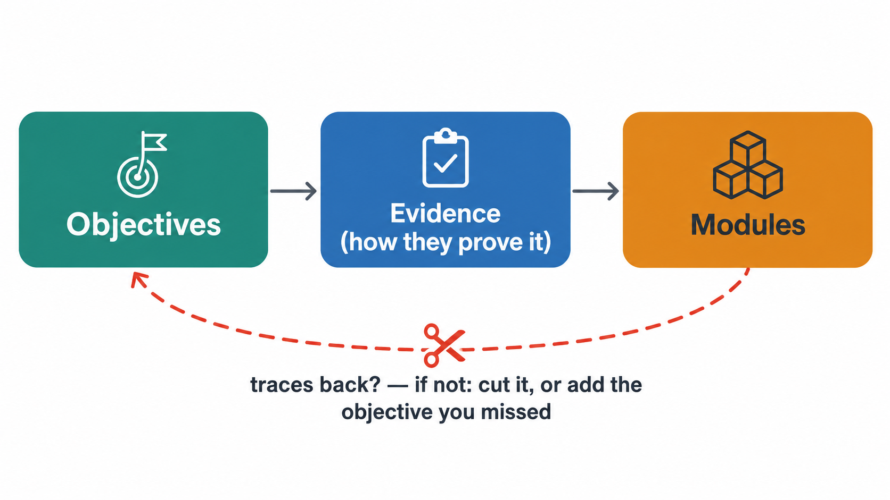{width=85%}

Don't plan modules by asking *"what do I want to cover?"* Work **backward from the end goal** — the approach known as **Backward Design** (Wiggins & McTighe, *Understanding by Design*). Three stages:

1. **Results** — what students must be able to *do* at the end. *You already have these: your objectives (§2).*
2. **Evidence** — how a student will *prove* they can do it: the assessment, artifact, or performance that demonstrates the objective is met. *(You'll formalize this in the MDD, but decide it now — it's what every module has to build toward. For us that's a task, a deliverable, or a teach-back — not necessarily a grade. If the evidence is **open-ended** — an essay, an analysis — see "bound the answer space" (§6, step 5b) to chart the range of valid answers ahead of time.)*
3. **Plan the modules** — backward-map the skills and knowledge a student needs to produce that evidence; **write each as a module objective** (Bloom-verbed, tagged →CO#); then **group those objectives into modules.**

So the full chain is **course objective → evidence → skills & knowledge → module objectives → modules.** The middle rung is the one people skip: *a skill or piece of knowledge, once you phrase it with a Bloom verb, **is** a module objective.* Backward Design hands you the skills; you write them as objectives; you cluster the objectives into modules. The test still holds: if a candidate module doesn't trace back to **one or more course objectives** and their evidence, something is wrong — but **check which thing** before you delete anything. There are two possibilities, and only one of them means cut:

- **It's scope creep** — content you want to teach that the goal doesn't need. *Cut it.*
- **You missed an objective** — the module is genuinely needed and your objectives were incomplete. *Add the objective*, and let the module stay.

The second case is common on a first pass, because objectives get written before you've thought the course through end to end. A module that won't trace back is a question, not a verdict: *is this content I want, or a goal I forgot to write down?*

**Deciding what to cut is hard to do alone.** When a cut isn't obvious, convene a **Design Council** — a small panel of AI personas chosen to *disagree* (a teacher, a curriculum developer, an administrator, a naive student), so the tradeoffs get argued out instead of smoothed over. It's your tool for the hard calls here and all through decomposition; the full method is in §6b.

**A module is a group of objectives, not a single objective.** Expect the map between course objectives and modules to be **many-to-many**, not one-to-one:

- One **course objective** usually fans out into **several module objectives** (to "parallel park," a student must *use the mirrors*, *judge the angle*, *reverse and cut the wheel*, *straighten out* — each a module objective).
- One **module** usually **bundles several module objectives**, and those can ladder to **different** course objectives. A module is organized around a coherent *concern* — a theme, a capability, a week — not around a single CO. *(In the Coffee example, Module 1 "The Setup & Your First Brew" carries four module objectives — three ladder to CO1, one to CO5. In a Data-Analytics course, one "Statistics" module carries six objectives spanning CO1, CO4, and CO5.)*

So don't look for one module per course objective. Build coherent chunks; let each chunk's objectives serve whichever course objectives they naturally support.

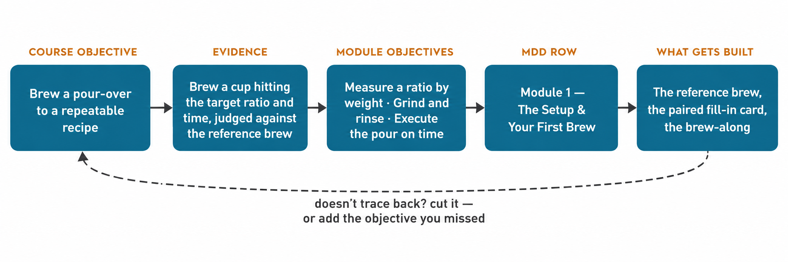{width=100%}

**The chain, made concrete.** Walk one course objective all the way down:

- *Coffee* — **Course objective:** brew a pour-over to a repeatable recipe (CO1). **→ Evidence:** on camera, brew a cup that hits your target ratio and time. **→ Skills the evidence needs:** measure by weight, grind, bloom, pour on time. **→ Module objectives** (each skill, Bloom-verbed and tagged): *(Apply) measure a ratio by weight (→CO1)* · *grind to a pour-over grind (→CO1)* · *execute the pour bloom-to-finish (→CO1)*. **→ Module:** these cluster into **one module — "The Setup & Your First Brew"** — because they share a concern ("your first real cup"). *Store beans properly (→CO5)* joins the same module: different course objective, same concern.
- *ML* — **Course objective:** implement an end-to-end pipeline (CO1). **→ Evidence:** a notebook that runs load → train → evaluate on a new dataset. **→ Skills the evidence needs:** load & split, preprocess, train, score, interpret. **→ Module objectives:** *(Apply) execute a complete pipeline, load → … → interpret (→CO1)* · *interpret coefficients in business terms (→CO5)* · *read residual-plot patterns (→CO4)* — three module objectives, three different course objectives, **one** coherent chunk. **→ Module:** they cluster into **Week 1 — "the pipeline,"** *not* four separate modules. Drop any skill the final notebook doesn't need.

- *A memo course (divergent work)* — **Course objective:** write a one-page decision memo a busy reader can act on (CO1). **→ Evidence:** a cold reader can say back your recommendation and your ask after a two-minute read, and the memo passes the reader's checklist. **→ Skills the evidence needs:** lead with the recommendation, state the ask explicitly, cut to one page.

**Evidence when there's no single right answer.** The first two examples converge — there's a target ratio, a notebook that runs. Open-ended work doesn't, so evidence takes a different shape: **an artifact + an observable reader-or-reviewer test + bounded criteria.** The artifact alone isn't evidence ("writes a memo" is not something you can watch succeed or fail); the *test* is what makes it observable. You build the bounded criteria in §6a, step 5b.

**Evidence for something you watch.** For a physical or performed skill, the shape is: **who watches + what they check it against + the number that passes.** "Brews a good cup" isn't evidence; "brews a cup judged against the reference brew, hitting the target ratio within tolerance, twice in a row" is.

## Reason about time in both directions

You can build **any format you like** — a 1.5-hour intro, a 3-hour workshop, a 5-week series, a 12-week course. There's no required shape. What you *do* need is to reason about time, and it goes two ways:

- **Time-first** — *"I have this much time; what's the deepest **coherent** set of modules that fits?"* The depth rule (§7) does the cutting; the contact-hour estimate proves the fit.
- **Content-first** — *"I want to teach this; how much time will it take?"* Estimate the content, and the total tells you how long the course needs to be.

Either way you reconcile content against time. The **Contact-Hour companion** ([`Contact_Hour_Companion.pdf`](Contact_Hour_Companion.pdf)) is the tool for both — it carries example formats (workshop, 5-week, 12-week, etc.) as starting points and the per-hour benchmarks to estimate with. *These aren't academic courses — size them by contact time, not by a weekly-homework target.*

**Name your container before you size.** Whichever direction you reasoned, pin it down and write it where you'll see it: *session length × number of sessions = your contact-hour budget.* In **time-first** it's a given you started with; in **content-first** it's the total you just settled on. The fit-check (Step 6 below) checks each module against this number — so it has to exist first.

## The steps

> **AI can help here — WIDEN.** Before you cluster, check the module list for holes.
>
> *"Here are my course objectives and my module list. What modules would a course like this usually have that I don't? Don't reorganise mine."*
>
> **Verify:** each one is either a real gap or a deliberate exclusion you can now name.

> **AI can help here — SIMULATE.** After you sequence, test the order from the student's side.
>
> *"You're a student who just finished Module 3. Based only on that, what do you expect Module 4 to teach? What would confuse you if it came next?"*
>
> **Verify:** if its expectation doesn't match your Module 4, your order has a seam.

Work Steps 1–2 across **all** your course objectives first; *only then* cluster. Clusters cross CO boundaries — a module often serves several course objectives — so the whole pool of module objectives has to exist before modules can emerge. Record each step as you go on the **Decompose worksheet** ([`templates/Decompose_TEMPLATE.docx`](templates/Decompose_TEMPLATE.docx)) — it has a slot per step and the module list at the end (which becomes your MDD rows).

1. **Name the result + the evidence** (Backward Design stages 1–2). For each course objective, write *how a student will prove it* right next to it — the task, artifact, or performance — and record it in **your Objectives doc** beside the objective (§2). The modules must build toward this evidence.
2. **List the skills & knowledge** that evidence requires ("to produce *that*, a student must be able to…"), and **write each as a module objective** — Bloom-verbed and tagged to the course objective it serves (→CO#). *These **are** your module objectives; a skill becomes one the moment you phrase it as something you can watch a student do.*
3. **Cluster** the whole pool of module objectives into candidate modules — *one module = one coherent **concern** (a theme, a capability, a week), which may carry several objectives serving several course objectives.* Sketch a concept map of the pool: related objectives group together, and each group becomes a candidate module — the cross-CO clusters show up here. *(Same concept-mapping move you'd build as a student feature in §3's Organize Knowledge — turned inward on your own design.)*
4. **Sequence** by prerequisite — each module builds on the one before. (This ordering is also what your module intros/conclusions will thread together; see below.)
5. **Surface each module's features** — apply the seven practices to each module: examine its objectives and name the features it needs (its hook, its worked example, its practice, its slice of the map). These features, with the **evidence** from Step 1, are the concrete activities you'll size next — and they go on to populate the MDD's *Activities* and *Materials* columns (§4). *(This is the per-module pass of the §3 audit: §3 ran the seven practices course-wide; here each module gets its own.)*
6. **Coarse fit-check — is each module about the right size?** A *rough* sizing pass, not a precise time budget.
   - **What it is:** a quick check that each module is roughly the right *size* for the time you'll give it — that you have the right *number* of right-sized modules, not one module secretly holding two (or two thin ones that should be one).
   - **What it's for:** to catch a mis-sized module *now*, while the fix is free — you just split or merge rows in a table. Carry a too-big module into the MDD and into building, and fixing it later means throwing away work you've already made. This is "decisions before production" applied to module *size*.
   - **What you size:** the **features** you just named (Step 5) plus the **evidence** (Step 1) — those are the module's real activities. You have no materials yet, so **ballpark** them against your **container**: benchmark the concrete pieces (a practice rep ~15–20 min, a video at its length, a reading by pages) with the **Contact-Hour companion** ([`Contact_Hour_Companion.pdf`](Contact_Hour_Companion.pdf)) and judge the scope. The **depth** you set in your Decisions doc (§1) tunes it — deeper means more minutes per piece. It returns a rough total — think *"~2–3 hours,"* not a line-item budget. Compare to the slot: **overflows → split it, cut depth, or move work to pre-/post-class; far under → merge with a neighbor.** You only need *fits / too big / too thin* — rough by design.
   - *You'll run the same companion again in §5 — there with the **real** minutes from the finished features, for the exact budget. Here you **size**; there you **budget**.*
7. **Iterate** until every module is roughly the right size *and* the order is sound.

**Output:** a module list — number, title, **its module objectives (each tagged →CO#)**, a **rough contact-hours estimate** (you'll refine it in §5), and order. This feeds directly into the MDD (§4): each row becomes a module table.

Here's what that looks like for the coffee course — the whole decompose output on one page:

| # | Module | Module objectives (→CO#) | ~ Time |
| --- | --- | --- | --- |
| 1 | The Setup & Your First Brew | measure a ratio by weight (→CO1) · grind & rinse (→CO1) · execute a pour-over on time (→CO1) · spot & store fresh beans (→CO5) | ~90 min |
| 2 | Tasting & Diagnosing | diagnose a flawed cup — sour / bitter / weak (→CO2) · explain extraction intuitively (→CO4) | ~90 min |
| 3 | Dial It In | adjust grind, ratio, or technique toward your taste (→CO3) | ~90 min |

Notice the CO tags fan out the way we said they would: **CO1** carries three of Module 1's objectives, **CO5** rides along in the same module, and **CO2 / CO4 / CO3** land in later modules — five course objectives distributed across three coherent modules, never one-to-one. Each row expands into a full module table in the MDD (§4). For the complete, laddered objective sets, see either worked example's `02_Objectives.md` (`2_Worked_Examples/Coffee/`, `2_Worked_Examples/IntroML/`).

## Thread the modules (intro + conclusion)

Once sequenced, give every module two small framing pieces — borrowed from the Georgetown SME module template:

- **Module introduction** — a short opening that hooks attention *and connects back* to what came before ("Last module you learned X; now we use it to…"). This is Activate Prior Learning made concrete.
- **Module conclusion** — a wrap-up that **pivots to the next module** ("You can now do Y — next we'll build on it to…").

These are what make a course *read* as one connected thread instead of a pile of modules — exactly the "flow and threading" the Review Council checks for. **Where they live:** the introduction is the opening of your first segment script; the conclusion is the last segment's transition. Name both in the MDD's *Activities* cell so the Review Council actually checks them — otherwise they're the first thing that quietly goes missing when you're building module seven.

> **This step also settles the container question** that otherwise bites you later: pre-class / live / practice / post-class are **phases, not fixed days.** Decomposition is where you decide how those phases map onto *your* real schedule.

Your modules are in order and each one traces back to an objective. Next, capture the whole plan in one place — the Master Design Document, your single source of truth.

---

# 4. Build the Master Design Document (MDD)

So far your plan lives in scattered pieces — a Decisions doc, some objectives, a module list. The MDD pulls them into one place: the spec you (or anyone, including GenAI) build the course from, in a **structured, tabular format** (adapted from Georgetown SCS). It has two parts.

**Part A — Course-Header Block** (fill once):

- Course name & description
- Course-level objectives
- Values, mapped to specific course features
- The seven practices, applied to *this* course
- **Assessment / How Success Is Measured** — how you'll know they got it. *If your program grades, describe the scheme here; many professional programs don't grade — they use completion + feedback.*
- Materials & media (curated media lives in the pre-class study guides; reference them, don't duplicate). *The study guide won't exist yet when you write the MDD — that's fine. The stub comes with the module skeleton you copy in §5, so you don't have to make one by hand. **Forward-reference it** (e.g., "→ Module 1 pre-class study guide"), create an empty stub now, and fill it when you produce materials (§6). Plan first, produce second.*

*A note on wording: **"module" is the generic unit** of a course. If you meet weekly, a module is simply a week — that's why the Intro-ML example calls its modules "weeks." Use whichever word fits your cadence; they mean the same thing here.*

**Part B — One Module Table per module**, always the same four columns:

| Module Objectives (→CO#) | Topics (sequential) | Materials & Media | Activities (what students do) |
|---|---|---|---|
| tagged to course objectives | in order | → pre-class study guide; `<Created>` = still to build | **named, concrete** activities |

The discipline that matters most: **name and itemize the activities.** Not "students practice" — write "Pair programming: *Regression Relay* — implement the pipeline on a housing variant (fill-in-the-blank)." Each activity should be a discrete, recognizable thing.

**A filled row, in both worlds:**

| Module Objectives (→CO#) | Topics | Materials & Media | Activities |
|---|---|---|---|
| *Coffee:* execute a guided pour-over (→CO1) | the kit; ratio by weight; the bloom; the pour | → M1 study guide; reference-brew video `<Created>` | Paired brew-along: dial a cup to the reference; brew-log |
| *ML:* execute a complete pipeline (→CO1) | load/split; train; evaluate; interpret | → Week-1 study guide; starter notebook `<Created>` | Pair programming: *Regression Relay* (fill-in-the-blank) |

**Conventions:** `→CO#` tags the objective ladder; `<Created>` marks media you still have to produce.

*Blank form:*
[`templates/MDD_TEMPLATE.docx`](templates/MDD_TEMPLATE.docx)

*Example:*
[`2_Worked_Examples/IntroML/03_Sample_MDD_Week1.pdf`](../2_Worked_Examples/IntroML/03_Sample_MDD_Week1.pdf)

> **AI can help here — CHECK.** Run the trace-back cold, before you build anything.
>
> *"Here are my course objectives and my module list. Name any module that doesn't trace to an objective, and any objective no module serves."*
>
> **Verify:** for each flag — scope creep to cut, or an objective you forgot to write? (§3.5's rule.)

> **Key separation:** the MDD says *what* activities happen. The **Teaching Guide** (Section 5) says *how and when* to deliver them — including the minute-by-minute agenda. Don't put delivery timing in the MDD.

## Coherence check #1 — the blueprint (cheapest)

Before you produce anything, **talk your whole MDD through with the AI** as a coherence check: *"Here's my course blueprint — does it hang together? Do the modules build in a sensible order? Anything that jumps, dangles, repeats, or assumes a skill no earlier module teaches?"* No AI tool to hand? Read the MDD aloud — to a colleague, or to yourself — against those same three questions; the questions do the work, not the tool. Keep it conversational — you're pressure-testing the *architecture*, not scoring a draft.

This is the **same concern** the Review Council scores later under "Consistency" (§6b) — coherence with the rest of the course — but checked at the **cheapest possible moment.** Whole-course coherence is checked at **three escalating points**:

| Moment | What | Cost to fix |
|---|---|---|
| **#1 Blueprint (here, §4)** | a conversation on the MDD, *before* production | free — you just rearrange a table |
| **#2 Per-module (§6b)** | the Review Council scores each drafted module's "Consistency" | cheap — revise one module |
| **#3 Whole-course (§6b)** | the Review Council across the finished course, end-to-end | costly — restructure built material |

It's *one* discipline, not three tools. Catch it on the blueprint and the later checks have little left to find — pure "decisions before production."

Your blueprint is done and coherent. Now you stop planning and start building — turning one row of the MDD into the three packages a student actually touches.

---

# 5. Structure the Module (Three Packages)

The MDD told you *what* a module contains. Now you **structure** it — decide what each of the module's **three packages** holds and lay them out. *(You **produce** the actual content next, in §6; here you're defining the shape and gathering what you'll build.)* Each package is written for a different audience, and building all three is what makes a course *portable* — it can be taught by someone other than you.

*For the home-coffee course, that's: **instructor** — the reference-brew recipe and a teaching-day checklist; **student** — a "taste your usual cup" warm-up (taste the coffee you currently make, as a baseline to improve on), a follow-along brew guide, and a brew-log; **teaching guide** — the timed session agenda.*

The features your seven-practices audit surfaced are already named in your MDD, so building these three packages *is* how you build them — you don't re-run the practices here; you build what the MDD lists.

*The items under each package below are a **recommended default, not a required checklist.** Take what your course actually needs — a 90-minute intro won't want deep dives; a five-week series might want all of them.*

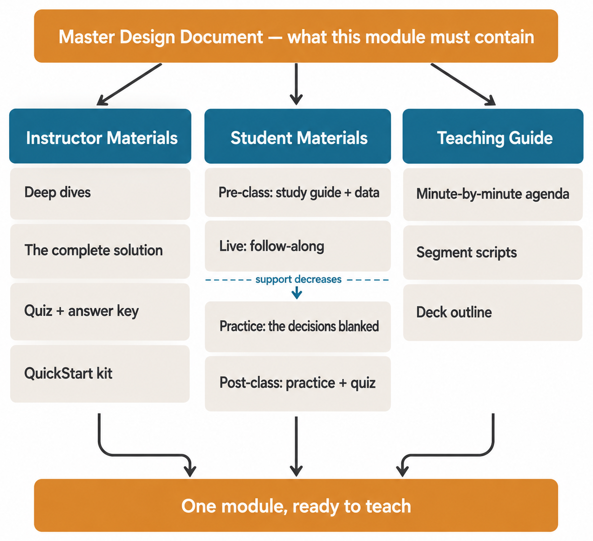{width=62%}

## 1. Instructor Materials — *"you won't remember everything"*
Everything an instructor (often you, months later) needs to get fully prepared with no outside help.

- **Deep dives** — background you should *know* but won't directly *teach*. The "know more than you teach" buffer: the next layer down is where student questions live, so you go there in prep even though it never appears in class.
- **The demo + solution materials** — the fully-worked version of whatever students will practice: the thing done right, completely, by you. Your "notebook" is whatever your students actually run or do — a `.ipynb`, a `.sql` script, a shell session, a spreadsheet, a dialed-in recipe, an annotated model memo. Whichever it is, name the tool, where the inputs live, and how to run one step. (§6a step 2 says what "complete" means in each medium.)
- **A self-check** — a short quiz/practice so *you* can confirm you understand the module before teaching it. (My rule: pass it yourself first.)
  *Why this is here, since it's easy to skip as obvious:* **writing a module and being able to teach it are different capabilities**, and the gap between them only shows up live, in front of people. Taking your own self-check is how you find the step you glossed over, the term you used before defining it, and the question you can't actually answer — at your desk, where fixing it costs ten minutes, instead of in the room, where it costs your credibility. It's the portability test applied to yourself: you be the other person who has to teach this from the page alone.
- **The student quiz and its key** — the self-check instrument students get (step 5a) and the answer key, derived from the complete solution so the two can't disagree. A quiz here is a self-check, never a grade.
- **A QuickStart kit** — the get-ready-fast materials: a files-by-segment reference, desktop/setup notes, physical materials and stations if your course has them, the pre- and post-class student emails, and a teaching-day checklist (which doubles as your hand-off list).

*Take what fits — these are a recommended default, not a required checklist.*

## 2. Student Materials — organized by *when* they're used
What students receive, sequenced across the learning arc.

- **Pre-class** — a study guide (curated videos/readings) plus a light warm-up, capped short so busy people actually do it (I budget about 30 minutes per session; set your own cap and hold to it). Students arrive primed, not cold. *If your audience has no pre-class time or no channel to reach them, fold it into the first fifteen minutes of the session, or send it as a handout from their supervisor.*
- **Live session / follow-along** — the **follow-along** material (complete and runnable — students execute and understand, they do *not* build from scratch live), plus a glossary, a cheat sheet, and the **practice activity** they do together.
- **Guided practice** — a longer, end-to-end walkthrough on fresh material, plus a **self-assessment** so students can gauge themselves.
- **Post-class** — more practice and an optional deeper challenge for those who want it, plus the short self-check quiz.

*For a code course, one more thing comes first: **the data.** Nothing runs without it, so build or fetch the dataset before the complete solution — the skeleton has a `pre_class/data/` slot for it.*

*These are **phases, not days.** "Live session" and "guided practice" are roles the material plays — follow-along, then guided application — whatever that looks like for your course. They might be one session, two days apart, or two weeks apart. Don't tie them to a calendar; map them onto your container.*

The organizing rule across student materials is the **gradual-release ramp**:

> **I do → we do → you do.** Full support during the live session, partial support in paired practice, minimal support in independent work — and the support *decreases* as the course goes on.

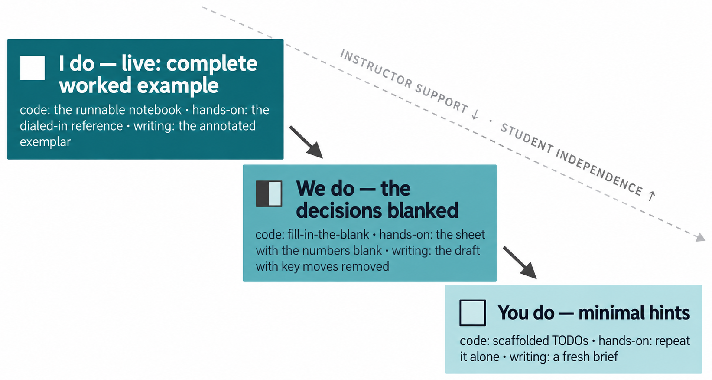{width=80%}

How you *implement* the "partial support" depends on your medium. **For a code-based course (my approach): live = complete code to run; paired practice = fill-in-the-blank (`____`); homework = scaffolded `TODO`s with hints.** For a non-code course, the same idea takes a different form — partially-completed templates, worksheets with prompts, or a worked example with steps left out. The *principle* (remove support gradually) is universal; **blanks and TODOs are the code-course form of it.**

**What a hint looks like.** A hint reminds the student of the *purpose* of a step; it never hands over the answer. The test is whether it lets them check themselves without you in the room — so a good hint ends with something they can verify:

> *Code* — `-- TODO: filter to one plant. Hint: the WHERE clause decides which rows survive; ask yourself which column names the plant. Check: you should get 12 rows.`
>
> *Hands-on* — "Why indicate the vise before you clamp? Think about the far end of the part. Check: the needle should move less than one division across the jaw."

**How to degrade well.** Blank the **decisions**, not the syntax — the point is to make them choose, not to make them type. Use a variant dataset or scenario so it isn't recall. Four to eight blanks is usually right. And print the expected result beside each blank, so feedback doesn't depend on you being there. *(Model to copy: the Coffee example's `paired_brew_FILLIN` card, under `Module1_folder_skeleton/Student_Materials/live_session/`.)*

**Guided practice sits between the rungs** — fill-in on fresh material, or TODOs with fuller hints. It is never the complete version; if it were, it'd be a second follow-along.

**Feedback without grades.** Most professional courses don't grade — they use completion plus feedback. That only works if the feedback is actually built, so here is where it comes from, in one place. **The reference artifact** is the benchmark: students compare their work to the complete solution, and the gap *is* the feedback (in the coffee course, the tasting is the feedback). **The expected results printed beside each blank** let a student self-correct in the moment, without waiting for you. **The self-check and self-assessment** let them gauge themselves between sessions. And for open-ended work, **the feedback envelope and bank** (§6a, 5b) mean most of your responses are written before the first submission. Four mechanisms, none of them a score — build them and "no grades" stops being a gap and starts being a design.

## 3. Teaching Guide — *"anyone can teach this"*
This is what makes the course survive without you in the room. It's the verbatim, segment-by-segment script of what to say and do — including the **minute-by-minute agenda** for each live session (`Teaching_Guide/minute_by_minute.md` in the skeleton).

> **Plan it here; write it in §6.** You can't script what to *say* until the materials exist — the script narrates the notebook, the practice, the demo. So in §5 you **sketch the agenda** (below) and keep the spec for the full script; you **write the segment scripts in §6**, after you've produced the materials they describe. (That's also why the agenda's *precise* minute budget, below, waits until the materials are real.)

**Write a timed agenda per session — a Time / Activity / Details table:**

| Time | Activity | Details |
|---|---|---|
| 0:00–0:20 | Welcome & roadmap | course/week framing; today's objectives |
| 0:20–0:50 | Concept | whiteboard X; introduce Y |
| 0:50–1:20 | Deep dive | … |
| 1:20–1:35 | Break | |
| 1:35–2:15 | Live demo | … |
| … | … | … |

Writing it forces honest pacing — it's where you find out you're over- or under-scoped before you're standing in front of the room. This agenda lives **here in the teaching guide, not in the MDD** (the MDD only *names* the activities; the teaching guide *sequences and times* them).

This timed agenda is also where your **precise time budget** will land — the payoff of §3.5's coarse fit-check. Sketch it now with your best estimates. You can't finish it yet: the readings, activities and practice don't exist until §6, and you can't sum minutes for materials you haven't built. **You budget it for keeps in §6a, step 6**, once they're real.

**How deep should the teaching guide go? Match it to who will teach.** The requirement is **portability** — *could someone teach this from your guide?* The *depth* you need to pass that test is a choice, exactly like the scaffolding ramp for students. Pick your level:

| Level | Teaching-guide depth | Use when |
| --- | --- | --- |
| **Floor** | The agenda (Time/Activity/Details) + a few **key talking points** per segment | *You* teach it and you're comfortable presenting your own material |
| **Full (gold)** | Verbatim, fully-scripted segments (the anatomy below) | Handing off to a substitute; you want to read close to verbatim; high-stakes or recorded delivery |

Neither is "more correct" — the floor that passes the portability test is enough. (If you, like many, want your words in front of you, the full version is a perfectly good choice — not over-engineering.) When in doubt, or when *anyone but you* might teach it, go fuller.

**Mixing tiers?** You don't have to pick one for the whole module. Go gold on any segment a substitute couldn't improvise — a discussion, a live demo, a build where the order matters — and leave the rest at the floor.

**The full (gold) version — script each segment.** Each row of the agenda becomes its own fully-scripted page. That depth is what lets a substitute teach your class without having designed it. The anatomy:

- **Segment objectives + materials** — what this 10–20 minutes accomplishes, and what you need in hand.
- **Verbatim script, broken into timed sub-blocks** (`[0:00–0:05]`, `[0:05–0:08]`…) — what to *say*, word for word, with inline **stage cues** (`[SHOW]`, `[WRITE]`, `[DRAW]`, `[PAUSE]`, `[WAIT for responses]`). You won't read it robotically, but having it means you know exactly what to convey.
- **Teaching tips** after each sub-block — tone, gestures, what to emphasize.
- **Common student questions — with answers.** Anticipate what they'll ask and bank the response.
- **Engagement questions.** 1–2 *instructor-posed* questions per segment that get at the **heart of the idea** — the intuition to grab, the place people most go wrong, or a "why does this matter to your work?" hook. (Different from the line above: those are what students ask *you*; these are what *you* pose to *them*.) Mark each with `[WAIT for responses]` and sprinkle them — one near the start, one at the conceptual turn, one before you reveal an answer.
- **A segment checklist** — including the hard timing checkpoint ("you're at 0:15").
- **A verbatim transition** into the next segment, so the class flows.
- **Instructor notes** — *if running long* (what to cut) and *if running short* (what to add), energy level, common pitfalls.

This is the level of detail that makes "anyone can teach it" true at the **gold** tier. **Full examples:**

- code —
  [`2_Worked_Examples/IntroML/…/Segment1_FULLY_SHOWN.pdf`](../2_Worked_Examples/IntroML/Week1_folder_skeleton/Teaching_Guide/Day1/Segment1_FULLY_SHOWN.pdf)
- non-code —
  [`2_Worked_Examples/Coffee/…/Segment1_FULLY_SHOWN.pdf`](../2_Worked_Examples/Coffee/Module1_folder_skeleton/Teaching_Guide/Segment1_FULLY_SHOWN.pdf)
 *Note that the blank template is the superset: the two filled examples omit the timed sub-blocks, the checklist and the instructor notes to stay short. Calibrate to the template, not to them.*

**And here is the floor tier**, so you can see what you're choosing between. One agenda row, plus the talking points that go with it — that's the whole format:

> `| 0:20–0:50 | Concept: the one model | Draw the map on the board; name the three parts |`
>
> *Talking points:* (1) why the map has three parts and not five; (2) the misconception the analogy fixes; (3) the one question to ask before moving on.

That's enough for you to teach from, months later, and it takes minutes to write. The gold tier is what you add when someone *else* has to teach it. **Blank form for the gold tier:**
[`templates/Teaching_Guide_Segment_TEMPLATE.docx`](templates/Teaching_Guide_Segment_TEMPLATE.docx)

> **AI can help here — WIDEN.** If an activity is still vague, get candidates you can choose between.
>
> *"Module objective: [X]. My three rungs are [I do / we do / you do] = [Y]. Give me three concrete named activities for the 'we do' rung — each with what's provided and what the student supplies. Name them; don't write them."*
>
> **Verify:** you pick one, or none. *"Students practice"* is not something anyone can build from; a named activity is.

> **AI can help here — CHECK.** And test the thing this section is actually for:
>
> *"Read this teaching guide as someone who has never taught this subject. List every place you'd have to improvise."*
>
> **Verify:** every "improvise" is a hole. This is the portability bar — *could someone else teach it from the page alone?* — run by something that genuinely hasn't.

**Start from the blank template:** copy `Module_Skeleton_TEMPLATE/` for each module. Its file names are **generic on purpose** — they don't assume what *kind* of course you're building (code, hands-on, writing…), so the one skeleton fits any of them. **Rename each to your course's form** — `complete_solution` becomes `week1_demo.ipynb` for code, or a `recipe_card` for coffee; every stub carries a "code → … · non-code → …" hint. Two filled examples to copy from:

- code — `2_Worked_Examples/IntroML/Week1_folder_skeleton/`
- non-code — `2_Worked_Examples/Coffee/Module1_folder_skeleton/`
 Full file map: `Module_Skeleton_TEMPLATE/README.md`.

You know what each package contains. Next, you **produce** them (§6) — GenAI drafts under your guardrails. You don't need to know how to write every document by hand; the general moves carry you: **build the complete version first, then *degrade* it into practice** (I do → we do → you do), **ground every script in the real artifacts**, and reach for **Appendix D** when a feature needs craft. The *how* is §6; this section was the *what*.

---

# 6. Produce With GenAI (Under Guardrails)

Now produce. Treat GenAI as a fast junior author who has read your Decisions document: **you decide, it drafts, you verify every line.**

*This is the longest step — here's its shape: the production **loop** (6a), then two ways to review with AI — the **councils** (6b) and the **comprehensiveness check** (6c) — and finally **picking the tool that fits** (6d).*

## 6a. The Production Loop

**Run this loop once per module** — produce one module end to end (solution → practice → prose → assessment → verify → teaching guide → deck), then repeat for the next. Whole-course coherence isn't checked here; it's reviewed separately and later, after the modules exist (§6b).

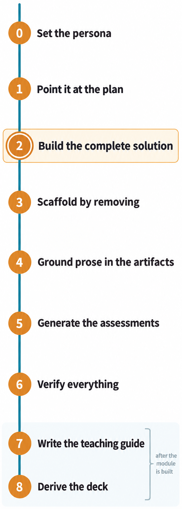{width=30%}

0. **Set the persona.** Ask the AI to *act as an expert in your field* (and where useful, as your audience). Drafts come out from the right vantage point.
1. Point it at the Decisions doc + the **module plan** (it now knows audience, depth, tone). *The module plan = that module's MDD row (objectives, topics, named activities) plus its minute-by-minute agenda — i.e., the outputs of Sections 4 and 5. It's the spec GenAI produces against; you're not asking it to invent the module, only to draft the materials the plan already calls for.*
2. **Build the complete, working solution first** — the full worked version (for a coding course, the complete notebook; for another domain, the finished worked example). *"Complete" means **correct and reproducible** — good enough that following it exactly produces the result. It does **not** need to be polished; it needs to **work**, because your practice version inherits its correctness. The test: could a student succeed by following it step for step?*

    **What "complete" looks like in each medium:**

    - **Code** — the notebook or script that runs top to bottom on the shipped data, with the expected output recorded beside each step. (For a non-notebook course, say which engine, where the data lives, and how to run one step.)
    - **Hands-on** — three things together: the sheet with every number and a one-line *why* per step; the thing itself done right and left where students can measure it against their own; and your own dated result.
    - **Judgment or writing** — an annotated exemplar (the model memo, the model conversation) with the standard stated beside each move, a deliberately poor version for contrast, and the bounded range of valid variants. **The exemplar is the solution; the range is the key** — you build that range in step 5b.

    *Whatever form it takes, this is the artifact every student-facing file is degraded from, so it's the one worth over-investing in. Craft notes for making it teach, not just work: Appendix D, **Mastery Craft**.*

    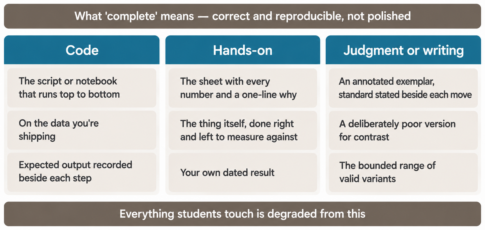{width=95%}
3. Create the scaffolded student versions by *removing* support from that complete solution — for a code course, blanking parameters and leaving `TODO`s; for other media, removing steps from a worked template. Because the practice version is *derived* from one that works, it's guaranteed correct.
4. Ground all prose (scripts, cheat sheets, guides) in the real artifacts — the notebook is the source of truth, the guide describes it.
5. **Generate the assessments — two cases, depending on whether the answer converges.**
    - **5a — convergent (one right answer):** generate the quizzes and practice sets. Step 2 already built the single correct solution, so the answer key is derivable from it (a quiz item, a coding exercise).
    - **5b — divergent (many valid answers): bound the answer space.** For an analysis, an essay, a memo, or a capstone, there is no single solution to derive a key from. So you chart the range *before* anyone submits. **How to actually do it:**
        1. **Name your axes first** — the three or four things you'd comment on in any submission (for a memo: is the recommendation first? is the ask explicit? is the evidence sufficient? is it one page?). These come from your exemplar's annotations (step 2), not from the AI.
        2. **Have the AI answer your own assignment eight to ten times**, varying the approach each time — not once with "give me ten variations," which collapses into one voice.
        3. **Sort what comes back by axis** into *strong / typical / off-base.* That table is your **feedback envelope** — it tells you what you'll actually see.
        4. **Write the feedback bank from it**: two or three sentences you'd say to each band, in your course's voice. You now have most of your feedback written before the first submission.
        - **Where it lives:** the envelope and bank go in the instructor package, as
          `reference_solution/solutions_and_key.md`;
          the student-facing half is a checklist in `guided_practice/`.
        - **When the AI's range is weak** — and for judgment-, context- or opinion-heavy work it will be (see the limitations note below) — the axes still come from your exemplar. Write the bands yourself and let the AI only stress-test them.
        - *Worked example:* the IntroML example's `05_Bounding_The_Answer_Space` file walks one real assignment end to end — the axes, the prompt, the collected range, the envelope and the bank.

        You're using the AI as a rough *simulator of the student population* to chart the answer space — never to judge a student's work. **It's a feedback envelope, not a grading one:** it tells you what to say, not what to score.

        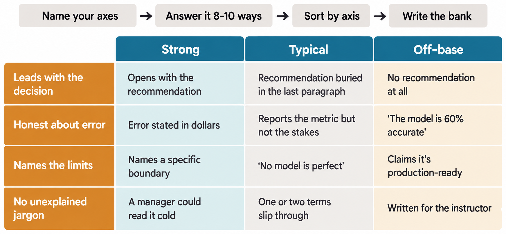{width=95%}
6. **Verify everything** — run it, check that hints guide without giving answers, and **budget the time for keeps.** The materials now exist, so run the **Contact-Hour companion** again with the **real** minutes and sum them across pre-class, live, practice and post-class. §3.5 sized the module with ballpark numbers; this is where the number becomes true. If a package pushes the module past its container, fix it *here* — trim depth, cut a piece, or move work to pre-/post-class — before you script or build anything further.
7. **Write the teaching guide — now the materials exist.** With the module built and verified, you can finally script what to *say* about it. §5 gave you the spec and the agenda; here you write the **verbatim segment scripts** that narrate the produced materials (the notebook, the practice, the demo). This is why the teaching guide comes near-last — it describes things that didn't exist until step 6. *(Use the §5 anatomy + [`templates/Teaching_Guide_Segment_TEMPLATE.docx`](templates/Teaching_Guide_Segment_TEMPLATE.docx); AI drafts from the real artifacts, you verify and keep your voice.)*
8. **Turn the module into delivery media.** Once a module is finished, verified, *and scripted*, **derive** the slide deck from it — don't write a new one. This is the same move as step 3 (*derive by removing*) and step 4 (*ground prose in the artifacts*): the verified module is the source of truth, the deck is downstream of it. A **beat** is one timed sub-block of the segment script — so "one slide per beat" means the deck tracks what you actually say, in order. *(Blank form: `Module_Skeleton_TEMPLATE/Teaching_Guide/deck_outline.md`.)* And "deck" means whatever your room shows: slides, printed boards, cards at the station — derived the same way. The teaching guide's verbatim segment script (from step 7) **is** the narration; the deck just visualizes it, beat by beat. Point the AI at the segment transcript and the notebook/worked example and ask for a deck that **mirrors** them — one slide per beat, figures and code lifted from the real artifacts, speaker notes pulled from the script. The hard rule: **the deck visualizes; it never invents.** If a slide wants a fact, an example, or a number that isn't already in the verified module, that's a red flag — either it's wrong, or the module is missing something and you fix it *upstream* first, then let the deck inherit the correction. Build slides *first* and they become the de facto curriculum you never checked; build the module, verify it, *then* let the deck inherit its correctness. Same Command Rule as everywhere else: AI drafts the deck, **you** verify every slide against the source and keep your voice.

> **Limitations of bounding the answer space — read before you trust it.** The LLM is **not your students.** It skews to the *competent median*, so it will **miss the tails** — both the creative-but-valid answer a sharp student gives and the naive-wrong one a struggling student gives. It can be **confidently wrong** (apply the red-flag tells), so its "range" may include answers that aren't actually valid and exclude ones that are. It works best where answers are **derivable from given data** (an analytics capstone) and weakest for judgment-, context-, or opinion-heavy tasks where your real audience's reasoning differs from the model's. So: use it to **widen** your sense of the range and seed feedback — never to **define** the acceptable set. Don't let it anchor you into marking down a valid answer it didn't think of. Treat its output as input (the Command Rule), verify against real student work, and **update the envelope after the first run** (§9, Evaluate & Improve).

**Good uses (asking is fine — deciding stays with you):**

- "Is my idea/structure **complete** — what's missing?" Use it as a stress-test. *You* make the final call on what to keep.
- "What's the **best way to present** this concept?" / "What **well-known material** explains this best?" Great for finding angles and proven explanations.
- "Act as a skeptical student / SME — where does this break?"
- **Draft engagement questions.** "Here's this segment. Give me 3–4 questions that get at the *heart* of this idea — the intuition a learner must grab, where they most commonly go wrong, and a 'why does this matter to your work?' hook. Open and discussable, not recall trivia — and not the questions a student would ask *me*." Then **you** keep the two or three that actually open the concept, rewrite each into your voice and an audience-fit analogy, and sprinkle them through the lecture (one live checkpoint every few minutes). *It drafts the probes; you decide which serve the lesson and where they land.*
- **Draft candidate analogies.** Same generate-then-curate move as engagement questions: ask AI for several analogies for a concept — *and which misconception each one clears up* — then keep the one or two that ring true and rewrite them in your voice. (Analogy is a teaching signature in its own right — the **two-analogy** technique and the worked example live in *Analogy Craft*, Appendix D.)

{width=62%}

**The guardrails (where your judgment stays):**

- **You decide what and how hard.** GenAI never silently picks scope or difficulty. Asking for input is not the same as delegating the decision.
- **Police tone.** Reject condescending or answer-giving hints.
- **Verify everything — it's confidently wrong often enough that every line has to be checked.** Confident-and-wrong is the default failure mode. This applies to *both* you (the builder) and your students: anything GenAI produces gets checked against how the tools actually behave. Teaching students to verify AI output is part of the course, not separate from it.
- **Read it for coherence, not just correctness.** AI writing often drops you into the middle of a conversation — it assumes context it never established and references ideas it hasn't set up yet. That "walked in halfway" disorientation is a hallmark of generated text. Your job is to give it a beginning, connect the pieces, and make it flow as if one person thought it through start to finish.
- **Keep your voice.** Edit until it reads like you; students learn better from material that sounds like the person teaching it.
- **You own it.** This is where "verify everything" stops being hygiene and becomes accountability. The Command Rule cuts both ways — because you decide and verify, **"the AI wrote it" is never an excuse** for an error, a stale fact, or a tone you'd never use. Sign your name to every line as if you'd written it cold. (Disclosing that AI assisted is a lighter, still-emerging courtesy — fine to do, worth a sentence in your syllabus — but it's the *ownership* that's non-negotiable, not the footnote.)

**From one module to ten.** The loop runs once per module, and "then repeat" hides a few decisions worth making once, up front, rather than discovering them at module four:

- **Course-level vs per-module.** Your Decisions doc, objectives, practices audit and MDD Part A are written **once** for the whole course. Everything else is per module. Don't re-litigate the course-level pages each time — if one genuinely needs to change, change it there and let every module inherit it.
- **Build in MDD order.** Module 3's hook-back refers to module 2, so building out of order means writing threading lines about modules that don't exist yet. The decompose output (§3.5) already gave you the order; follow it.
- **Names are fixed by module one.** Rename the skeleton once, then build later modules by copying your *filled* module 1 rather than the blank skeleton. That one habit is most of what makes ten modules look like one course.
- **If two of you are building**, both hold the same Decisions doc and MDD and neither edits them unilaterally — changes go through whoever owns the MDD (§9). Split by module, never by layer; two people each building half of every module is how voice drift starts.
- **Check for drift at the end.** Run the Review Council per module as you go, then once more across the finished course (§6b) with the MDD and every agenda in front of it. That last pass is the one that catches the module that quietly became a different course.

## 6b. The Two AI Councils — Design and Review

A council is a panel of AI personas you convene to widen your perspective. Use **two different councils at two different times** — and don't confuse them.

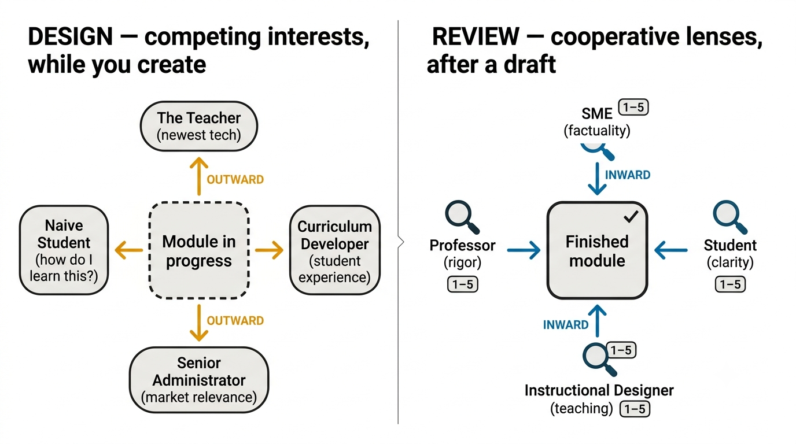{width=95%}

### The Design Council — run it *while you create* (personas chosen to disagree)

Before and during design, convene a panel whose members **want different things.** The friction is the point: engineered disagreement surfaces tradeoffs a single agreeable advisor would smooth over. A standing set that works:

| Persona | What they push for |
|---|---|
| **The Teacher** | The newest, most engaging tools and techniques |
| **The Curriculum Developer** | Student experience and teaching effectiveness |
| **The Senior Administrator** | Market relevance and industry-ready skills |
| **The naive Student** | "I don't know this yet — how do I actually learn it, and why does it matter?" |

Invoke them while you're making decisions, decomposing, and writing the MDD: *"Council, weigh in — where do you disagree on this?"* You're not chasing consensus; you want the **tension** (novelty vs. learnability vs. relevance vs. accessibility) so you decide it on purpose. **They advise; you decide** (the Command Rule, §0). (Keep the persona table where you can paste it — §10 has it written out as a ready-made system prompt.)

### The Review Council — run it *after a draft exists* (cooperative lenses, scored)

Once a module is drafted, convene a *different* panel — four **cooperative** reviewers who all want the module to be good, each checking a distinct lens. It catches what a single pass misses, *before* the module reaches students.

**The panel and what each lens checks:**

| Persona | Lens |
|---|---|
| Subject-Matter Expert | Factuality / domain correctness |
| Student | Clarity — "can I actually follow this?" |
| Instructional Designer | Teaching principles / structure |
| Professor | Rigor / depth / soundness |

**Add the lens your field can't ship without.** These four are a starting panel, not a fixed one — if your course carries a risk the four wouldn't catch, seat someone for it. A safety officer, for a shop-floor course: *"can anyone get hurt following this exactly as written?"* A compliance reviewer, a clinician, an accessibility specialist — whoever would be the first to object in your world.

**Evaluate each module on five dimensions** — have the council rate each **1–5** and give an **overall score** plus a **ship / revise** verdict:

1. **Consistency** — internally coherent; consistent with the rest of the course. *(This is coherence moments #2 and #3 — you already checked the whole architecture cheaply at the blueprint stage, §4. Little should be left to find here.)*
2. **Delivery** — clear, well-paced, teachable.
3. **Factuality** — correct, no subtle errors.
4. **Teaching principles** — honors the seven practices, scaffolding, tone.
5. **Overall score.**

**Throughout, probe flow and threading:** "Does this connect to what came before? Is the thread easy to follow? Does anything jump or dangle?"

**When to run it (the cadence):**

- **After every module** — the moment a module's materials are drafted (right after Section 6 production), *before* you move on to the next module. Revise that module, then continue. Running it per-module keeps small problems from compounding across the course.
- **Once more at the very end** — run the same panel across the *entire* course for end-to-end consistency and threading.

The council *advises*; you decide. A low score is a prompt to revise, not an order — but ignoring a factuality flag is on you.

## 6c. The Comprehensiveness Check

When your course design is drafted, do one last sweep against the wider world. Ask an LLM:

> *"For courses that teach **[your subject]** to **[your audience]**, what topics do they typically cover that I might be missing? And what diagrams, models, or explanations do they commonly use to teach the hard parts?"*

**Why:** you built your course from *your* understanding (which is right — teach from what you know). This check catches the **blind spots** — a topic that's standard in the field but outside your own mental map, or a proven visual that explains a sticky concept better than your prose.

**The rule:** the answer is **input, not instruction.** You do **not** have to incorporate what comes back — much of it may be out of scope, too deep, or wrong for your audience (apply the depth rule, §7). Its job is to make sure you're *excluding things on purpose*, not by accident. A real gap in necessary knowledge is worth fixing; everything else you note and move on.

Run this on the **whole course**, late — after decomposition and a draft MDD, so you're checking real coverage, not a sketch.

## 6d. Pick the Tool That Fits the Artifact

The loop above is tool-agnostic on purpose. One chat window can do most of it — but the failure mode is **reaching for the same tool by habit** instead of the one that fits the job. The **capability** is what's durable; the **product** that provides it this year is not — so the table names *capabilities*, and the specific tools are quarantined in one dated note you can refresh without touching the method.

> **Pick the tool that fits the artifact, not by habit.** Match the tool to what you're making — citations, synthesis, prose, a diagram, an image, a deck. The names rot; the fit is the point.

| Task (the durable capability) | Why it wants its own tool |
|---|---|
| Current research with citations | Live sources you can open and check — not the model's memory. |
| Synthesis / Q&A over *your* sources | Answers grounded in documents **you** supply (your Decisions doc, readings), not the open web. |
| Drafting, code, reasoning | The workhorse of the §6 loop — solutions, scaffolds, prose, councils. |
| Diagrams from text | Turns a paragraph into a clean diagram. |
| Images / illustrations | Generated figures and visuals (mind licensing). |
| Slides from a transcript | Step 8 — feed it the **verified** segment script; it visualizes, you verify. |

Whatever the tool, the Command Rule holds: it drafts, you verify and keep your voice.

> **Tools I use right now (as of 2026 — expect this to change):** research/citations → *Perplexity* (verify its citations; they can be stale or wrong) · synthesis over my sources → *NotebookLM* · drafting/code/reasoning → *Claude* · diagrams → *Napkin.ai* · images → *Nanobanana* · slides → *Gamma*. **This callout is the only part of §6 built to go stale — refresh it yearly; the table above doesn't move.**

You can build a module now. One decision has been quietly shaping all of it — how far down to go. That's next.

---

# 7. Set Depth: How Far Down Do You Go?

The most common question — "how deep do I go?" — has a rule:

> **Go only as deep as the audience's goal requires; stop when going deeper wouldn't benefit *them*.**

For most workplace domain experts, the goal is usually an **MVP / proof-of-concept**, so you go deep enough that they can make and debug decisions — and no deeper. The heuristic:

> **Keep asking "why" until you'd be comfortable saying "I don't know" to the class.** Most people stop at a reasonable place. The ones who'd go deeper anyway will — you wouldn't have stopped them.

> **AI can help here — SIMULATE.** The rule above is an interrogation, and AI will ask "why" indefinitely without getting bored or embarrassed.
>
> *"I'm teaching [X] to [audience] whose goal is [Y]. Ask me 'why' about my explanation, one question at a time. Don't answer for me."*
>
> **Verify:** stop when you'd be comfortable saying *"I don't know"* to the class. It supplies the questions; **the stopping point is your judgment about your audience, and stays yours.**

And a check on your own curiosity: *will going deeper benefit the students, or just satisfy me?* If it's only you, stop. Depth should be **additive** — if questions come in deeper than expected, refine *up* next time. Never go subtractive ("I just went over their heads").

**Where to stop — two examples:**

- *Coffee* — teach the ratio, grind, and water temperature that reliably make a good cup, and how to taste and adjust. Stop before the chemistry of extraction kinetics — keep that in your back pocket for the student who asks (the "know more than you teach" buffer, §5).
- *ML* — teach how to build a pipeline, evaluate a model, and diagnose the common failures. Stop before the linear-algebra proofs behind the optimizer — a practitioner needs to *use* the tool well, not re-derive it.

Once you've set the depth, make sure everyone can actually reach it — design the course so it works for every learner.

---

# 8. Design for All Learners (Accessibility)

A course only works if people can actually *get into* it — and people vary widely, in ability, device, language, and circumstance. Designing for access isn't a special-case add-on; it makes the course better for everyone (the curb-cut effect: captions help the deaf *and* the person in a loud room).

The standard frame is **Universal Design for Learning (UDL)** — offer more than one way through three things:

> **AI can help here — PRODUCE.** Alt-text is the most-skipped item in this section and the most mechanical. Draft it, then read every line against the image.
>
> *"Here is my module text and a list of its visuals with what each shows. For each, draft alt-text that conveys what the visual teaches, not just what it depicts."*
>
> **Verify:** if the alt-text would let a student answer the question the visual supports, it is right.

> **AI can help here — TRANSLATE.** Captions and transcripts are a reformat, not new content.
>
> *"Turn this segment script into captions and this demo into a written transcript. Add nothing that isn't in the source."*
>
> **Verify:** nothing new appeared. That is the whole test.

- **Representation** — present content in more than one mode. Don't make a concept reachable only by reading, or only by a diagram. Pair visuals with text; add captions/transcripts to video; write alt-text for images; define jargon (your glossary does this); don't rely on color alone to carry meaning; keep fonts readable and contrast high.
- **Engagement** — give more than one reason and way to stay in it. Make relevance explicit; offer choices where you can; chunk into manageable pieces; keep structure predictable.
- **Action & Expression** — let people show what they know in more than one way. A teach-back *or* a written artifact; flexible deadlines where feasible; scaffolding so the path is climbable.

**UDL in one course.** For the home-coffee course: the pour taught three ways — a captioned video, a written recipe card, and a simple diagram (Representation); relevance made explicit, "café coffee for pennies" (Engagement); mastery shown by an on-camera brew *or* a brew-log (Action & Expression). The same three modes hold for an ML module — a runnable notebook, a written walkthrough, and a diagram; a dataset they care about; a teach-back or a submitted notebook.

> **AI can help here — CHECK.** Run the one-mode-only audit before you walk the checklist by hand.
>
> *"Flag any concept in these materials reachable only one way — only by reading, only by a diagram, only by hearing me say it."*
>
> **Verify:** you decide which gaps are worth closing. Not all are.

> **AI can help here — WIDEN.** And ask what you haven't thought of.
>
> *"My module is [X] for [audience]. What access barriers should I be thinking about for this kind of material that I probably haven't?"*
>
> **Verify:** input, not instruction — you decide which are real for your learners.

**Practical checklist for course builders:**

- [ ] Materials are real text, not pictures of text (so they're searchable and screen-reader-friendly); use proper headings.
- [ ] Every video has captions or a transcript; every meaningful image has a short text description.
- [ ] Color is never the *only* signal (add labels/shapes/text).
- [ ] Reading level and language fit the audience; key terms are defined.
- [ ] There's more than one way to engage with the hard parts (read it, see it, try it).
- [ ] If digital, it works with a keyboard and reasonable zoom.
- [ ] If physical, every learner can reach it, see it, and stand (or sit) for the work.

**How this connects to the method:** your scaffolding (§5) and the depth rule (§7) already lower barriers; the glossary and cheat sheets are representation aids; the visualize-as-much-as-possible habit is one mode — *pair it with text, don't replace text with it.* You don't have to do everything on this list — but make access a **deliberate choice**, not an afterthought.

Your course is built and within reach for every learner. The last step isn't the end of the work — it's how you make the next run better than this one.

---

# 9. Evaluate & Improve

Building the course isn't the end — delivering it is the start of making it better. A course is a living artifact: you watch it run, learn where it breaks, and refine the next version. (In the classic ADDIE cycle, this is the *Implement → Evaluate* end that most first-time builders skip.)

**What "did it work?" means — four levels (Kirkpatrick):**

1. **Reaction** — did learners find it clear and worthwhile? *(A two-minute end-of-session pulse: what landed, what didn't.)*
2. **Learning** — can they actually do the objective? *You already designed this: it's the evidence/assessment from Backward Design (§3.5).*
3. **Behavior** — are they using it for real afterward? *(e.g., did they apply it on the job or ship a real project?)*
4. **Results** — did it move the outcome that mattered at the program level?

**The four levels, for the coffee course:** *Reaction* — "was the session worth your Saturday?"; *Learning* — can they brew the target cup on camera?; *Behavior* — a month later, are they still brewing this way instead of their old habit?; *Results* — did they stop buying \$6 café coffee? Most courses only ever check the first two — the real payoff is **Behavior.**

You don't need a formal study. **Lightweight is enough:**

- **During delivery:** watch where people get stuck and where energy drops — those are live signals.
- **After each run, hold a short retro:** What confused people? What ran long or short versus your contact-hour estimate (§3.5)? Which questions came up again and again? Repeated questions are missing content or a missing FAQ.
- > **AI can help here — SIMULATE.** Before you have real feedback, run a pre-mortem.
>
> *"You took this module and it didn't work for you. You're not hostile, just honest. What went wrong?"*
>
> **Verify:** a prompt for what to watch for — never a finding.

> **AI can help here — TRANSLATE.** After the retro, turn notes into changes that land somewhere.
>
> *"Here are my notes from the run. Turn them into specific changes, each naming the MDD row or module file it lands in. Don't propose anything my notes don't support."*
>
> **Verify:** every change traces to something you actually observed.

**Improve additively** (the depth rule's principle): refine *up* where questions went deeper than expected; don't gut what worked.
- **Land the changes in the MDD and teaching guide** so the next run starts better than this one did.
- **Update the feedback envelope** (§6a, 5b) with what students actually submitted. The AI's predicted range was a stand-in; real work is the correction. This is the step that turns one run's surprises into next run's prepared feedback.

**If other people teach it.** The loop above assumes you're the one in the room. When you're not, three things keep ten rooms from drifting into ten courses: **one retro form per room**, so you're comparing like with like; **one named MDD owner**, recorded in the MDD's version row; and a rule that **changes land in the MDD first** — the owner bumps the version and re-issues the teaching guide, rather than each instructor patching their own copy. Instructors send change requests; they don't edit locally. That's the whole governance model, and for most courses it's enough.

**Where this sits relative to the councils:** the two AI councils (§6b) and the comprehensiveness check (§6c) are *pre-delivery* reviews; this is the *post-delivery* loop. Together they close the cycle — review before you ship, evaluate after you teach.

That's the method, start to finish. Everything you need to *do* it — the blank forms and checklists — is gathered next.

---

## Front it for students: the syllabus

> **AI can help here — TRANSLATE.** The syllabus is a reformat of decisions you already made, so let AI do the reformatting.
>
> *"From this Decisions doc and MDD, draft the student-facing syllabus. Every fact must come from one of them."*
>
> **Verify:** any fact that isn't already upstream is invented — cut it, or fix the upstream doc.

One artifact your students see that the steps above never told you to build: the **syllabus**. Good news — it isn't new work, it's a *reformat*. Everything in it you've already decided: who it's for and what they'll be able to do (your Decisions doc + objectives), the schedule and how they're assessed (your MDD), and the materials (your modules). So write it **last**, once the pieces exist, and it falls out in an hour. See either worked example's `00_Syllabus` for the shape.

---

# 10. Templates & Checklists

The blank forms you fill in as you go. (All six are standalone files in `templates/`; the quality checklists are below.)

**Prefer plain text?** Each template below links to the **Word** version, since these are forms you type into — but a Markdown copy of every one sits beside it in the same folder: same content, same filename, `.md` instead of `.docx`.

> **If you downloaded the guide on its own**, the `2_Worked_Examples/` links won't resolve — the two worked examples ship as a separate download, and the paths are printed in full so you can still find them there. The complete bundle has both side by side.

- **Decisions document** (one page) — [`Decisions_TEMPLATE.docx`](templates/Decisions_TEMPLATE.docx) (filled models: [`2_Worked_Examples/IntroML/01_Decisions.pdf`](../2_Worked_Examples/IntroML/01_Decisions.pdf) and [`2_Worked_Examples/Coffee/01_Decisions.pdf`](../2_Worked_Examples/Coffee/01_Decisions.pdf)).
- **Learning objectives** — [`Objectives_TEMPLATE.docx`](templates/Objectives_TEMPLATE.docx).
- **Seven-practices audit** — [`Seven_Practices_Audit_TEMPLATE.docx`](templates/Seven_Practices_Audit_TEMPLATE.docx).
- **Decompose worksheet** — [`Decompose_TEMPLATE.docx`](templates/Decompose_TEMPLATE.docx) (§3.5: objectives → evidence → module objectives → modules → fit-check; its module list feeds the MDD).
- **Master Design Document** — [`MDD_TEMPLATE.docx`](templates/MDD_TEMPLATE.docx).
- **Teaching-guide segment** (gold tier) — [`Teaching_Guide_Segment_TEMPLATE.docx`](templates/Teaching_Guide_Segment_TEMPLATE.docx)
- **Minute-by-minute module agenda** — the Time / Activity / Details table (Section 5, Teaching Guide) — `Module_Skeleton_TEMPLATE/Teaching_Guide/minute_by_minute.md`.
- **Deck outline** — one slide per beat, derived from the segment script — `Module_Skeleton_TEMPLATE/Teaching_Guide/deck_outline.md`.
- **Module-folder skeleton (blank, generic names)** — `Module_Skeleton_TEMPLATE/` (copy per module, rename each file to your course's form). Filled examples: `2_Worked_Examples/IntroML/` (code) and `2_Worked_Examples/Coffee/` (non-code).
- **Module decomposition output** — module list with objectives, estimated contact hours, and order (Section 3.5).
- **Contact-hour estimate** — [`Contact_Hour_Companion.pdf`](Contact_Hour_Companion.pdf) (the time-sizing table).
- **Bloom's verb reference** — Appendix A. **Seven-practices question bank** — Appendix B.

**The two councils, as a reusable system prompt.** A *system prompt* is the standing instruction you give an AI tool at the start of a project, so you don't retype your context every time. Paste whichever council you need and leave it there:

> **Design Council (while you create).** "Act as a panel of four who want different things, and argue it out rather than agreeing: **The Teacher** (pushes for the newest, most engaging techniques), **The Curriculum Developer** (pushes for coherence and what fits the time), **The Administrator** (pushes for what's practical, affordable and scalable), **The Naive Student** (pushes back on anything they can't follow). When I describe a decision, tell me where you disagree and why. Don't reach consensus — surface the tradeoff. I decide."

> **Review Council (after a draft exists).** "Act as four cooperative reviewers of the module I give you, each using one lens: **Subject-Matter Expert** (factuality), **Student** (clarity — can I follow this?), **Instructional Designer** (teaching principles and structure), **Professor** (rigor and depth). Add a lens my field needs if one is missing. Rate the module 1–5 on consistency, delivery, factuality and teaching principles, give an overall score, and end with a ship-or-revise verdict and the three specific changes that would most improve it."

**Quality checklists.** These three also ship as a **standalone one-page card** — [`Quality_Checklists_Card.pdf`](Quality_Checklists_Card.pdf) — because unlike everything else in this section you'll use them *repeatedly and away from this page*: once per objective, once per module, every module. Print it; don't come back here.

*Objectives:*

- [ ] Measurable verb?
- [ ] Student-focused?
- [ ] Right altitude?
- [ ] Laddered to a course objective?
- [ ] Assessable?

*MDD:*

- [ ] Every module has objectives / topics / materials / activities?
- [ ] Objectives tagged →CO#?
- [ ] Activities named, not vague?
- [ ] Practice-before-assessment present?
- [ ] Values shown?

*One module:*

- [ ] All three packages present?
- [ ] Portable — could someone teach it from the guide alone?
- [ ] Scaffolded, not blank?
- [ ] Correct / verified?
- [ ] Visual where it helps?
- [ ] A way for students to self-check?

---

# Teaching It Well — The Craft That Carries It

Everything up to here builds a course *anyone* can teach — that's the promise, and it's the floor. This last part is different: it's how *I* teach — the craft that turns a solid course into one people remember and walk out of feeling like they gained something. None of it is required to pass the portability test; all of it is what I believe made my courses land. I opened this guide by telling you *why* I wrote it. Here's *how* I teach.

**1. Show the whole picture before the pieces.** I sketch the map before I've earned every detail on it. People learn far better when they can see where a thing is going — every fact then has a place to land instead of floating loose. (It's why this guide opens with the one-line method and a figure, not chapter one.)

**2. Break the complex into small, sure steps.** The skill I trust most is taking something intimidating and cutting it into pieces small enough that each one feels *doable.* Confidence compounds — a learner who just succeeded at a small thing leans into the next. Never hand someone the mountain; hand them the first step.

**3. Make it land — an analogy for clarity, a story for memory.** A hard idea becomes simple through the right analogy, drawn from the world the learner already lives in (Appendix D, *Analogy Craft*) — backprop is seasoning a chicken. And whenever I can, *especially at the front of the room,* I wrap it in a **story** — because a story is what people still remember a week later. The analogy makes the idea *clear;* the story makes it *stick.* Both in your own voice, never a borrowed one.

**4. Draw it live — and make it visual and interactive.** When I can, I don't *show* a finished diagram — I **draw it live, on a virtual whiteboard,** because building it in front of the class forces me to slow down and *talk through every piece as it appears.* The construction *is* the teaching; a finished image skips the part that matters. Where a static picture is the right call, I now make *exactly* the one my point needs — LLMs will generate any visual that fits your style. And I lean on **interactive HTML** — something students can poke, drag, and change — because a thing you can play with teaches more than a thing you only watch. (This is §8's "visualize as much as possible," taken all the way: live, custom, and interactive.)

**5. Go slow, and put your energy where the content earns it.** I teach **deliberately slowly** — the pace that lets an idea actually sink in, not the one that covers the most slides. And I **match my energy to the weight of the material:** I lift it for the thing that matters and let it settle for the thing that doesn't. Students read your energy to know what's important — so spend it on purpose.

**6. Teach warm — and be the first to say "I didn't get this either."** I keep a beginner's mindset on purpose, and I'm openly vulnerable about my own struggles. When someone gives a wrong answer, I don't correct-and-move-on — I say *"I didn't understand this at first, either."* When I taught diffusion for image generation, I told the class straight out that I'd struggled to learn it and *still* had open questions, and that we'd **work through it together.** That does what a confident lecture can't: it makes not-knowing safe, turns the room into fellow travelers, and gives people permission to be lost — which is the only place learning starts. Warmth isn't soft; it's what makes a class brave.

**7. Ask, don't just tell.** I sprinkle questions through a lesson that get at the *heart* of an idea — the intuition to grab, where people go wrong, the "why does this matter to *your* work?" hook (§5, §6). A question a learner answers themselves sticks; a fact I recite washes off. Teaching is a conversation I'm steering, not a broadcast.

**8. Leave them wanting the next room.** The truest sign a class worked isn't the applause — it's that people keep going after it's over. So I open loops on purpose and make the subject feel bigger and more inviting than the time we had. Spark the curiosity and the learning doesn't stop when you do.

These aren't a checklist to perform — they're how I show up. The method in this guide makes a course teachable by anyone; this is how you make it *unforgettable.* Put your version of these into every course you build, and your name is on it in the only way that matters — the way people feel when they learn from you.

---

# Appendix A — Bloom's Taxonomy (full reference)

Six levels, low to high. Each level's definition and a full list of measurable action verbs. Pick the verb that matches what you want students to actually *do*. *(Anderson & Krathwohl, 2001 — revised Bloom's.)*

> **Note:** some verbs appear at more than one level (e.g., *choose, compare, select*). That's expected — a verb's level is set by the **cognitive task**, not the word alone. "Compare two options" can be Understand, Analyze, or Evaluate depending on what the comparison demands. Use the level that matches the thinking you want.

| Level | What it asks of the student | Measurable action verbs |
|---|---|---|
| **1. Remember** | recall facts, terms, and basic concepts | choose, define, find, identify, label, list, locate, match, name, omit, recall, recognize, relate, select, show, spell, state, tell, what, when, where, which, who, why |
| **2. Understand** | explain ideas; organize, compare, interpret | classify, compare, contrast, demonstrate, explain, extend, illustrate, infer, interpret, outline, paraphrase, rephrase, show, summarize, translate |
| **3. Apply** | use knowledge in new situations; solve problems | apply, build, choose, construct, develop, experiment with, identify, interview, make use of, model, organize, plan, select, solve, utilize |
| **4. Analyze** | break into parts; find evidence, motives, relationships | analyze, assume, categorize, classify, compare, conclude, contrast, discover, dissect, distinguish, divide, examine, function, inspect, list, motive, simplify, survey, test for, theme |
| **5. Evaluate** | judge against criteria; defend an opinion or decision | appraise, argue, assess, award, choose, conclude, criticize, decide, deduct, defend, determine, disprove, estimate, evaluate, importance, influence, interpret, judge, justify, mark, measure, prioritize, prove, rate, recommend, rule on, select, support, value |
| **6. Create** | combine elements into a new pattern; propose alternatives | adapt, build, change, combine, compile, compose, construct, create, delete, design, develop, discuss, elaborate, estimate, formulate, imagine, improve, invent, make up, maximize, minimize, modify, originate, plan, predict, propose, solve, suppose, test |

### Words to avoid (not measurable)

You can't observe these — replace each with a verb above: *believe, comprehend, conceptualize, experience, feel, grasp, hear, know, learn, listen, memorize, perceive, realize, see, understand* — and phrases like *appreciation for…, awareness of…, familiar with…, knowledge of…, understanding of….*

**Not a contradiction:** the *level* **Understand** (above) is legitimate — it's the vague *verb* "understand" that isn't measurable. Reach for the Understand-level verbs (explain, interpret, summarize) instead.

---

# Appendix B — The Seven Practices: Full Question Bank

Lead with the anchor question (Section 3); reach here when a section feels thin. *(Adapted from the Georgetown SCS Course Design Framework.)*

**1. Activate Prior Learning**

- What examples/analogies connect what students already know to this content? *(Build two: one for the **intuition**, one aimed at the **misconception** — the place they predictably go wrong, with an everyday image that makes the _wrong_ turn feel wrong.)*
- What should students already know before this course?
- Which concepts build on knowledge students should already have?

**2. Organize Knowledge**

- What is the interrelationship among the key concepts?
- Can you draw a concept map of how they relate and build on one another?
- How do the key concepts build on each other — and on prior knowledge?

**3. Motivate**

- What excites you about this course? What would excite students?
- What stories or real-life examples help explain this content?
- How could a student apply this to their job? Examples from their profession?
- Why is this content important for them to know?

**4. Develop Mastery**

- What examples/models reflect the performance level to benchmark against?
- What examples reflect *poor* performance?
- Can the work be broken into smaller chunks across the term?
- Under what real conditions would students do a similar task?
- How does this prepare them for later content?

**5. Practice & Provide Feedback**

- How do students practice before being assessed?
- How can instructor feedback come *before* the final product?
- What goals would you give them to practice toward?

**6. Student Development & Course Climate**

- What traits do highly effective practitioners in this field have?
- What professional organizations/forums relate to this content?
- What examples reflect diversity and inclusion?
- What discussion questions are pertinent? How might students connect socially?
- What group activities help them acquire the skills?

**7. Self-Directed Learners**

- Can you share assignments that highlight strong vs. weak performance?
- What resources let them keep learning after the course?
- What rules-of-thumb can students use to assess their own work?
- What should they reflect on to analyze their own performance?
- Where in the material should they pause and self-evaluate?

---

# Appendix C — Frameworks This Guide Stands On

This guide is practical on purpose — it favors plain language over citing models. But it's built on established work. If you want to read deeper, here's what's under the hood and where it shows up.

| Framework | What it is (one line) | Where we use it | Read more |
| --- | --- | --- | --- |
| **Backward Design / Understanding by Design** (Wiggins & McTighe) | Start from the end goal: results → evidence → learning plan | §3.5 (Decompose: objectives → evidence → modules) | ASCD; *Understanding by Design* |
| **Bloom's Taxonomy** (Anderson & Krathwohl, 2001) | Six levels of cognitive demand with measurable verbs | §2, Appendix A | Wikipedia: "Bloom's taxonomy" |
| **ADDIE model** | The classic build cycle: Analyze, Design, Develop, Implement, Evaluate | The overall arc (§0–§9) | Wikipedia: "ADDIE model" |
| **Cognitive Load Theory** (Sweller) | Don't overload working memory; worked examples beat problem-solving for novices | §5 (complete follow-along material; scaffolding) | Wikipedia: "Cognitive load" |
| **Gagné's Nine Events of Instruction** | A proven sequence for a lesson (gain attention → assess → transfer) | §5 + the teaching guide (segment structure; pre/live/post) | Wikipedia: "Nine events of instruction" |
| **ARCS Model of Motivation** (Keller) | Attention, Relevance, Confidence, Satisfaction | §3 (the *Motivate* practice) | Keller, ARCS model |
| **Universal Design for Learning (UDL)** (CAST) | Multiple means of representation, engagement, action/expression | §8 (Accessibility) | udlguidelines.cast.org |
| **Kirkpatrick's Four Levels** | Evaluate training at Reaction, Learning, Behavior, Results | §9 (Evaluate & Improve) | Wikipedia: "Kirkpatrick model" |
| **Retrieval & Spaced Practice** (learning science) | Recalling and revisiting beats re-reading | §5 (practice) + post-class | *Make It Stick*; retrievalpractice.org |
| **How Learning Works** (Ambrose et al.) / the seven practices | Research-based teaching principles | §3 (the seven-practices audit) | *How Learning Works* (Ambrose et al.) |

*These are pointers, not required reading. The method works without them — they're here so you know it's standing on solid ground, and so you can go deeper on any piece.*

*Want to learn instructional design more broadly? The companion reading list [`Learning_About_Instructional_Design.pdf`](Learning_About_Instructional_Design.pdf) (bundled with this guide) gathers good starting points — backwards design, adult-learning principles, scaffolding, human-centered design, rubrics for course quality, and more.*

---

# Appendix D — Building the Seven Features (Craft Notes)

*The seven-practices audit (§3) tells you **what** features your course needs; these tell you _how_ to build a good version of each — one note per practice: why it's high-leverage, the moves, what AI can and can't do, and a worked example. Pull the one you need when a feature feels thin.*

## Analogy Craft — teaching to explain simply

Analogy is how a hard idea becomes a simple one, and it may be the highest-leverage thing you do at the board — so it gets its own practice. A concept worth teaching earns **two** analogies, each doing a different job:

- **Analogy #1 builds the intuition** — it connects the new idea to something the audience already lives in.
- **Analogy #2 targets the misconception** — the specific place learners predictably go wrong — and bends the picture so the *wrong* turn feels wrong.

The skill underneath is **teaching to explain simply**, and it's worth practicing on purpose — and handing to students, because making *them* build the analogy is how you find out whether they actually understand the thing. AI can *generate* candidates (see §6, *Draft candidate analogies*), but a borrowed analogy in someone else's voice falls flat: **you** keep the one or two that ring true, rewrite them into your world and your audience's (a tech for tractors hears it differently than a data scientist does), and check that the mapping actually holds.

> **Worked example — backpropagation as seasoning a chicken.** Training a model is like seasoning a chicken. You add a little salt and pepper, you taste, and the taste tells you *which way you were off* — too bland, too salty — so you adjust and taste again, closing in on right. That's backprop: **the seasoning is the weights** you're tuning, **the tasting is evaluating the loss** (how far off the dish is), and **the adjust-and-taste-again is the gradient step,** nudging each weight the direction the taste says to go. Round after round, the seasoning dials in. *Analogy #2, for the misconception:* people think the model lands on the answer in one shot. It doesn't — nobody seasons perfectly on the first shake. You *iterate*: taste, adjust, taste, adjust. The error isn't a failure; it's the information that tells you which way to move. Notice the move — warm, concrete, *theirs* (everyone has over-salted something), with a precise mapping underneath. That's the whole technique.

## Structure Craft — turn a pile of facts into a map

Experts hold a subject as a *connected structure*; novices hold it as a *pile of facts* — and the pile is why they can't retrieve or transfer what they learned, relearning every case from scratch. Organizing the knowledge is what turns "I memorized twenty things" into "I see how this fits," and it does double duty: the same map that helps students is what shows *you* the natural module boundaries (see §3.5). The moves:

- **Links are labeled *relationships*, not just lines.** A concept map is concepts joined by *named* relationships — "requires," "is a kind of," "causes," "trades off against." The label is where the learning lives: *"grind size → controls extraction → drives taste"* teaches more than the three terms sitting side by side.
- **Find the spine first.** Every domain has a backbone — a process, a cycle, a hierarchy, a cause-effect chain, a spectrum. Name the one organizing principle and hang everything off it. A map with no spine is just a tangle.
- **Show the whole before the parts.** The map isn't only your design tool — give students a version of it (a diagram, an advance organizer at the module intro, a "you are here"). When they see the structure first, each new piece has a place to land.
- **Test it by navigating.** A good structure lets a learner answer *"where does this fit?"* and *"what connects to what?"* If a concept has no links, or everything links to everything, the structure is wrong — fix it before you build content on top of it.

AI will happily *draw* a concept map — but it over-connects (everything relates to everything) and rarely picks the *one* spine that matters for your audience. Use it to surface candidate concepts and relationships; **you** choose the spine and prune to the links that carry weight.

> **Worked example — coffee, pile vs. map.** The pile: *grind, water temperature, ratio, brew time, bean freshness* — five variables to memorize. The map: put **extraction** on the spine, and every variable becomes a labeled lever on it — *"grind finer → faster extraction → bitter if you overshoot,"* *"cooler water → slower extraction → sour if you undershoot."* Now a beginner can *reason*: a sour cup means under-extraction, so grind finer or go hotter. The labeled cause-effect map *is* the understanding — and "extraction" is exactly the boundary that makes it one coherent module.

## Motivation Craft — make them care before you teach

A learner who doesn't care won't learn — attention is the gate everything else passes through, which makes this the practice people most often *wave at* ("this matters because it's foundational") instead of *building*. The research frame is **ARCS** (Keller): **A**ttention, **R**elevance, **C**onfidence, **S**atisfaction. In practice it's four moves:

- **Make relevance personal, not field-level.** "X is important in today's economy" motivates no one. Connect to a stake *this* learner already has — a problem they hit, a goal they want, a frustration they feel. The test: can they finish *"I want this because* `___`*"* in their own words?
- **Lead with the payoff, not the prerequisites.** People are pulled by the destination and repelled by the runway. Show the useful end result *first* — the working app, the café-quality cup — then say what it takes. Don't make them earn the motivation by slogging through fundamentals.
- **Open on a real tension.** A hook works when learners *feel* the gap between where they are and where they want to be. "Everyone's made a bad cup of coffee" surfaces a pain the course then resolves.
- **Engineer an early win.** Nothing motivates like "I just did that." Design one real, reachable success in the first session (ARCS *Confidence*) — it buys you patience for the harder parts.

AI can draft candidate hooks, but relevance is **audience-specific** — one that lands for a data scientist falls flat for a tech maintaining tractors. You supply the audience truth; AI generates options; you keep the one that rings true for *your* people.

> **Worked example — a weak hook vs. a strong one.** Weak: *"Machine learning is a foundational skill in today's economy."* (Field-relevance, no personal stake, no payoff, no tension — nobody leans in.) Strong: *"By the end of today you'll have a model running that predicts house prices from real data — and you'll see exactly where it's wrong and why. No calculus. Now think of a prediction *you'd* actually want to make at work — we'll build toward that."* Notice the moves stacked: payoff first ("a model running today"), an early win ("by the end of today"), confidence ("no calculus"), and relevance made personal ("a prediction *you'd* want to make").

## Mastery Craft — show them what "good" looks like

People can't hit a target they can't see. Novices don't know what *good* looks like, so they can't aim for it or judge how far off they are — showing a complete, expert-quality example at the level to reach is one of the highest-return moves in teaching (the *worked-example effect*: studying a solved example beats grinding one out from scratch). The moves:

- **Show the whole, finished thing — the benchmark.** Not a fragment; the real deliverable, done well, so "good" is concrete. The Worked Examples that ship with this guide *are* this move — a full module at the bar to aim at.
- **Make the standard explicit.** Don't just show it — say *why* it's good (the two or three things that make it work), so learners can judge their own against the same criteria.
- **Show the process, not only the product.** Reveal how an expert got there — the false starts, the checks, the "I'd redo this." Otherwise learners think experts nail it first try, which is both false and demoralizing.
- **Then fade it.** They reproduce it with support, then without — that's the scaffolding ramp (§5), and the benchmark is where the ramp starts.

AI drafts a plausibly-good example fast, but *good* is domain- and audience-specific; it tends to hand you the generically-competent version that misses what your field actually prizes. You set the bar and verify the example is genuinely exemplary — an off benchmark teaches the wrong target.

> **Worked example — the reference brew.** The coffee course had no model of mastery until the audit forced one: an **instructor reference brew** students taste at the start (*this* is what you're aiming at) and taste their own against. For a code course it's the complete, verified pipeline notebook — the thing that runs, that they build toward.

## Practice Craft — let them try before it counts

You don't learn a skill by watching someone do it — you learn by doing it, getting feedback, and doing it again, *before* the stakes are real. It's the step most courses skip: they explain, then assess, with no safe middle. The moves:

- **Practice the objective's actual verb.** If the objective is to *implement* a pipeline, they practice implementing — not answering quiz questions *about* pipelines. Practice that doesn't match the verb builds the wrong skill.
- **Keep it low-stakes.** Practice is for making mistakes cheaply; the moment it's graded, it's assessment, not practice. Protect a space where being wrong costs nothing.
- **Make feedback timely and specific.** "Good job" isn't feedback; *"your split leaks test data into training — here's why that inflates the score"* is. Feedback that arrives after it counts is too late to learn from.
- **Degrade it from the worked version.** The cleanest practice is the benchmark with holes cut in it (fill-in-the-blank, TODOs) — because it's a working thing with parts removed, the practice can't be subtly wrong.

AI generates practice items and even feedback well, but it pitches difficulty unevenly and defaults to generic notes; you set the difficulty ramp and aim the feedback at the specific misconception. *(Fuller build: the scaffolding ramp, §5, and* build-complete-then-degrade*, §6.)*

> **Worked example — the brew-along.** A paired brew-along where the *tasting is the feedback* — immediate, specific, low-stakes — then a week-long brew log to practice alone before anything is assessed.

## Climate Craft — make it safe to be a beginner

Fear shuts learning down. A learner afraid of looking stupid won't ask the question, try the risky thing, or admit they're lost — and every one of those is required to learn. Climate is the invisible variable that gates all the others, and it's where you grow the *person* into a practitioner, not just fill them with content. The moves:

- **Normalize struggle and error, out loud.** Say that confusion and mistakes are expected, and model your own — "debugging is normal," "nobody seasons perfectly on the first shake." A visible instructor misstep gives everyone permission.
- **Design for every learner, not the median.** Vary your examples (not all sports or war metaphors), don't assume background that quietly excludes, and offer more than one way in (this is UDL, §8). Ask: whose experience does each example assume?
- **Set the norms explicitly.** How questions work, how feedback is given (specific *and* kind), and the flat rule that *no question is too basic*. Say it in week one; hold to it.
- **Name the practitioner's traits and build reps for them.** Curiosity, skepticism, persistence — decide which a strong practitioner in your field has, then design moments that *exercise* them, not just mention them.

AI can scan your examples for assumed knowledge and suggest inclusive alternatives, but climate is set by *you* — in the room and in the tone of every artifact. It's a design *value* (see §0), not a feature bolted on at the end.

> **Worked example — open on a shared failure.** The coffee course opens by having everyone recall a bad cup: now no one is the only novice, mistakes are the *subject*, and the room is safe to be wrong in. "Debugging is normal" does the same job for a code course.

## Self-Direction Craft — set them up to keep going without you

A course ends; learning shouldn't. The real win is a learner who keeps improving after you're gone — anything less builds dependence, not capability, and that's what separates a course from a crutch. The moves:

- **Hand over your tools.** The cheat sheets, checklists, reference examples, and "how I'd debug this" heuristics you used — give them, so learners self-serve instead of coming back to you.
- **Teach the meta-skill, not just the answers.** How to find the answer, judge a source, run the next experiment — the fishing rod, not the fish. A learner who can *figure things out* outlasts one who memorized this year's facts.
- **Point to the next rung.** A curated "where to go deeper" — optional dives, a reading or two, the community — so momentum survives the last session instead of dying at the door.
- **Build in self-assessment.** A way for them to gauge their *own* understanding (the module's self-check) so they can steer without you grading them.

The highest-leverage take-home now is teaching them to **keep learning with AI** — under the same guardrails you use in this course (it proposes; you verify). Model it, and they leave with a tutor that never closes.

> **Worked example — the take-home kit.** Coffee: a recipe card + a "how to dial in *any* coffee" heuristic + a short resource list. Code: the cheat sheet + a "how to debug a model" checklist + pointers to the next topics — plus the habit of asking AI well.

---

\begin{mdframed}[style=cmcta]
\textbf{Now go build one.}\, Open \texttt{templates/Decisions\_TEMPLATE.md} and fill the first page — audience, objective, depth. That single page is what everything in this guide hangs from, and it takes about twenty minutes. \textbf{Build one module end to end before you scale to the rest}: the first one is slow because you're learning the method, and every one after it inherits the decisions you just made.
\end{mdframed}
