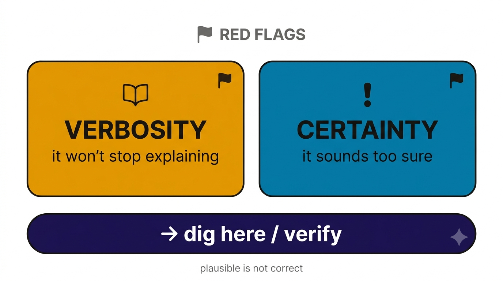

# Reviewing AI Output — Two Red Flags

*A take-home card for checking anything an AI drafts for you. "Verify everything" is hard to act on; these two tells show you **where to dig first.***

{width=85%}

## The two flags

**1. Verbosity** — it's over-explaining.
Reasoning models especially pad, restate, and pile on caveats. Length is often hiding thin or wrong substance. **When it won't stop explaining, slow down and check what it's actually claiming.**

**2. Certainty** — it sounds *too* sure.
Hedge-free, confident statements with no "it depends" are a tell, not a comfort. The most confident sentence is often the one to verify. **Overconfidence is where it's most likely confidently wrong.**

> **Rule of thumb:** *the more it over-explains and the more certain it sounds, the harder you check.* Plausible is not correct.

## What to do when a flag trips
- Trace the specific claim back to a source you trust (the real tool's behavior, the data, the docs).
- Ask it to state its uncertainty: "What in this are you least sure about?"
- Cross-check with a second prompt or a second model.

## Remember
The AI **advises or drafts; you decide and verify** (the Command Rule). It's wrong a meaningful fraction of the time, in *subtle* ways — these two flags are your fast triage for finding it.
